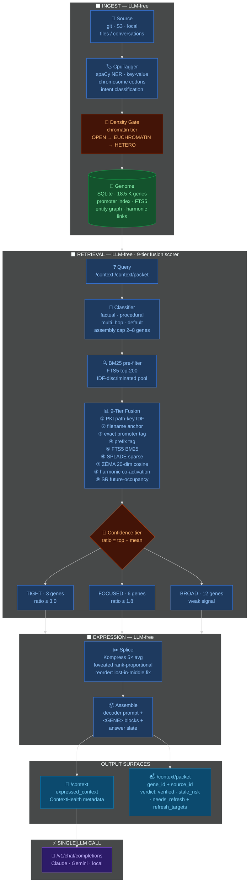

# Helix Context

[](https://opensource.org/licenses/Apache-2.0)
[](https://pypi.org/project/helix-context/)
[](https://www.python.org/downloads/)
[](docs/architecture/PIPELINE_LANES.md)
[](https://mbachaud.substack.com/p/agentome)

A context-index engine for LLM agents. Helix retrieves, weighs, and compresses your codebase into a context window — **without a single LLM call on the retrieval path.**

**28.7× token savings on production workloads** · GPQA diamond +4 pp accuracy with context on · 5.4× median across 15 query types

---

## Benchmarks

> ⚙️ **Hardware:** Ryzen 7 5800x · 48 GB DDR4 · RTX 3080 Ti 12 GB VRAM · 2× 1 TB NVMe · open case, reactive fan curves · model: **gemma4:e4b** (Ollama) · genome: 18,547 genes

| Query | Type | Helix tokens | RAG baseline | Savings |
|---|---|---|---|---|
| "How does helix handle WAL checkpoints?" | mechanism-internal | 279 | 8,000 | **28.7×** |
| "What does the access-rate tiebreaker do?" | operational rule | 394 | 8,000 | **20.3×** |
| "What port does the helix proxy listen on?" | point-fact lookup | 399 | 8,000 | **20.1×** |
| "What is the role of the harmonic_links table?" | data structure purpose | 753 | 8,000 | **10.6×** |
| "What does path_key_index store?" | data structure purpose | 1,023 | 8,000 | **7.8×** |
| "How does the density gate work?" | conceptual system | 2,971 | 8,000 | **2.7×** |

*RAG baseline: top-5 chunks × 1,500 tokens + 500 overhead = 8,000 tokens/query (Pinecone/LangChain defaults). Full bench: [`benchmarks/bench_rag_vs_sike_tokens.py`](benchmarks/bench_rag_vs_sike_tokens.py) — rerun yourself.*

**GPQA diamond accuracy — gemma4:e4b, N=100:**
OFF baseline: **22%** → Helix ON: **26%** **(+4 pp)** · Source: [`benchmarks/bench_aa_suite.py`](benchmarks/bench_aa_suite.py)

---

## Pipeline



*Dark-shipped features (entity graph Tier 5b, sub-query decomposition, BGE-M3 ANN) are omitted. See [`docs/architecture/DIMENSIONS.md`](docs/architecture/DIMENSIONS.md) for the full dimension inventory.*

<details>
<summary>▶ Terminal walkthrough — launcher startup + first query</summary>

**Part 1 — Launch**

```
$ helix-launcher

[00:00.1]  helix-launcher v0.5.0
[00:00.2]  config: helix.toml
[00:00.3]  genome: genomes/main/genome.db  (18,547 genes · 5.0× compression)
[00:00.8]  starting helix server on :11437 ...
[00:01.4]  ✓  helix server      http://127.0.0.1:11437
[00:01.6]  starting observability stack ...
[00:02.1]  ✓  otel collector    :4317
[00:02.4]  ✓  prometheus        :9090
[00:02.9]  ✓  loki              :3100
[00:03.3]  ✓  grafana           :3000  →  http://localhost:3000
[00:03.4]  tray icon ready — right-click for controls
```

**Part 2 — First retrieval query**

```bash
curl -s http://127.0.0.1:11437/context \
  -H "Content-Type: application/json" \
  -d '{"query": "what port does helix use"}' \
  | python -m json.tool
```

```json
{
  "expressed_context": "<GENE src=\"helix.toml\" facts=\"port=11437\">\nThe helix proxy server listens on port 11437.\n</GENE>\n...",
  "genes_expressed": 5,
  "budget_tier": "focused",
  "context_health": {
    "retrieval_rate": 1.0,
    "top_score": 8.3,
    "score_ratio": 4.1
  }
}
```

Token cost: **399 tokens** delivered to the LLM vs 8,000 for a naive RAG top-5 pass — **20.1× savings.**

</details>

---

## Quick Start

```bash
# 1 — Install
pip install "helix-context[all]"

# 2 — Launch  (Windows · Linux/macOS: use helix-launcher)
start-helix-tray.bat
helix-status            # confirm :11437 is responding

# 3 — Seed your project
helix ingest ./my-project

# 4 — Test retrieval
curl http://localhost:11437/context \
  -H "Content-Type: application/json" \
  -d '{"query": "what is the main entry point?"}'
```

### Native observability (default)

Canonical path: the tray (`start-helix-tray.bat`) manages the native OpenTelemetry
binaries in `tools/native-otel/` automatically. A balloon notification confirms
the sidecar is running. To opt out: `HELIX_OBSERVABILITY=0 start-helix-tray.bat`.

> **Advanced — Docker stack:** if you prefer a full Docker-compose observability
> stack (Prometheus, Tempo, Loki, Grafana), see
> [deploy/otel/README.md](deploy/otel/README.md).

### MCP setup (Claude Code / Cursor / Continue)

Add to `~/.claude/settings.json` (or your IDE's MCP config):

```json
{
  "mcpServers": {
    "helix-context": {
      "command": "python",
      "args": ["-m", "helix_context.mcp_server"],
      "cwd": "/absolute/path/to/your/project",
      "env": { "HELIX_MCP_URL": "http://127.0.0.1:11437" }
    }
  }
}
```

### OpenAI-compatible proxy (zero code changes)

```bash
ANTHROPIC_BASE_URL=http://localhost:11437 claude
OPENAI_BASE_URL=http://localhost:11437/v1 your-app
```

---

## How It Works

**The entire retrieval and weighing path is LLM-free** — spaCy NER, Howard 2005 TCM, Stachenfeld SR, Werman W1, Hebbian co-activation. Pure CPU math from ingest to expressed context. The only LLM call in the whole system is at `/v1/chat/completions`. This matters for latency (sub-second retrieval), cost (no token spend on the retrieval path), and determinism.

**Two surfaces for two caller types:**

| | `/context` | `/context/packet` |
|---|---|---|
| Returns | Assembled compressed window | Pointer + verdict + refresh plan |
| LLM reads? | Directly | No — agent fetches if needed |
| Verdict emitted? | Via `ContextHealth` | First-class: `verified / stale_risk / needs_refresh` |
| Use for | Chat clients, Continue | MCP agents, tool use, programmatic decisions |

→ [PIPELINE_LANES.md](docs/architecture/PIPELINE_LANES.md) · [DIMENSIONS.md](docs/architecture/DIMENSIONS.md) · [Agentome paper](https://mbachaud.substack.com/p/agentome)

---

## Configuration

### Genome path

Set `path` in `[genome]` to move the database to any drive or directory:

```toml
[genome]
path = "genomes/main/genome.db"   # relative to helix run directory
# Put this on your fastest NVMe for best ingest throughput
# Example: path = "D:/helix/genome.db"
```

### Running multiple projects

One helix instance per genome — each reads its own `helix.toml`. Use the `helix_context.hgt` Python API to share genes across instances (Horizontal Gene Transfer).

### Backup

SQLite WAL mode makes it safe to copy the `.db` file while helix is running:

```bash
# cron / Linux
cp genomes/main/genome.db backups/genome-$(date +%Y%m%d).db
```

```powershell
# PowerShell / Windows
Copy-Item genomes\main\genome.db backups\genome-$(Get-Date -Format yyyyMMdd).db
```

*A built-in backup manager with configurable paths and interval is on the roadmap.*

### DAL — source content fetching

`/context/packet` returns `source_id` pointers. Callers resolve them to bytes via the DAL:

```python
from helix_context.adapters.dal import DAL

dal = DAL()                              # file + HTTP built-in
dal.register("s3", my_s3_fetcher)       # register additional schemes
text, meta = dal.fetch("s3://bucket/schema.json")
```

---

## API Reference

| Endpoint | Description |
|---|---|
| `POST /context` | Retrieve and assemble compressed context |
| `POST /context/packet` | Retrieve pointer + verdict (agent-safe) |
| `POST /ingest` | Add a document or exchange to the genome |
| `GET /stats` | Genome size, compression ratio, tier metrics |
| `GET /fingerprint` | Navigation-first retrieval (scores + metadata) |
| `POST /v1/chat/completions` | OpenAI-compatible proxy with automatic context injection |

→ Full endpoint reference: [`docs/api/endpoints.md`](docs/api/endpoints.md)
→ MCP tool schemas: [`docs/api/mcp-tools.md`](docs/api/mcp-tools.md)

---

## Architecture

| Doc | What it covers |
|---|---|
| [PIPELINE_LANES.md](docs/architecture/PIPELINE_LANES.md) | Swim-lane reference: ingest, context, packet, fingerprint flows |
| [DIMENSIONS.md](docs/architecture/DIMENSIONS.md) | The 9 retrieval dimensions — schema, data, bench status |
| [LAUNCHER.md](docs/architecture/LAUNCHER.md) | Supervisor, tray, observability stack lifecycle |
| [SESSION_REGISTRY.md](docs/architecture/SESSION_REGISTRY.md) | Multi-agent session + party isolation |
| [OBSERVABILITY.md](docs/architecture/OBSERVABILITY.md) | Prometheus metrics, Grafana dashboards, alert rules |
| [KNOWLEDGE_GRAPH.md](docs/architecture/KNOWLEDGE_GRAPH.md) | Entity graph, harmonic links, co-activation |

---

## Acknowledgments

Built on: [spaCy](https://spacy.io/) NER · [Howard 2005](https://doi.org/10.1037/0033-295X.112.3.559) TCM · [Stachenfeld 2017](https://www.nature.com/articles/nn.4650) SR · SQLite FTS5 BM25 · [Kompress](https://huggingface.co/chopratejas/kompress-base) compression

## License

Apache 2.0 — see [LICENSE](LICENSE).
