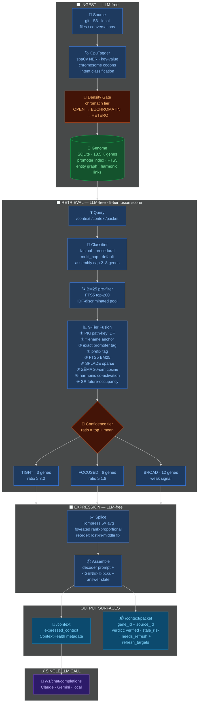

# README v2 + Docs Overhaul Implementation Plan

> **For agentic workers:** REQUIRED SUB-SKILL: Use superpowers:subagent-driven-development (recommended) or superpowers:executing-plans to implement this plan task-by-task. Steps use checkbox (`- [ ]`) syntax for tracking.

**Goal:** Replace the 639-line README with a benchmark-led v2, move internal docs to `docs/archive/`, create `docs/api/`, update `.gitignore`, bump to v0.5.0, and publish to GitHub + PyPI.

**Architecture:** Four sequential tasks, each independently committable. README is written from scratch using approved benchmark data from `benchmarks/results/overnight_e4b_2026-05-08_0012/`. No code changes — documentation and release only.

**Tech Stack:** Markdown, Mermaid (GitHub-native renderer), `python -m build`, `twine`, `gh` CLI.

**Spec:** `docs/superpowers/specs/2026-05-08-readme-v2-design.md`

---

## File map

| Action | Path |
|---|---|
| Modify | `README.md` — full rewrite |
| Modify | `.gitignore` — add 6 patterns |
| Create | `docs/api/endpoints.md` — HTTP endpoint reference |
| Create | `docs/api/mcp-tools.md` — MCP tool schemas |
| Create | `docs/archive/` — directory for moved internal docs |
| Move | `docs/research/` → `docs/archive/research/` |
| Move | `docs/collab/` → `docs/archive/collab/` |
| Move | `docs/superpowers/` → `docs/archive/superpowers/` |
| Move | `docs/papers/` → `docs/archive/papers/` |
| Move | `docs/positioning/` → `docs/archive/positioning/` |
| Move | `docs/specs/` → `docs/archive/specs/` |
| Move | `docs/plans/` → `docs/archive/plans/` |
| Move | `docs/FUTURE/` → `docs/archive/FUTURE/` |
| Move | `SESSION_HANDOFF.md` → `docs/archive/SESSION_HANDOFF.md` |
| Modify | `pyproject.toml` — version `0.4.0b1` → `0.5.0` |

---

## Task 1: .gitignore additions + version bump

**Files:**
- Modify: `.gitignore`
- Modify: `pyproject.toml`

- [ ] **1.1 Add patterns to .gitignore**

Open `.gitignore`. After the `benchmarks/*.stdout.log` block, add:

```gitignore
# Visual companion / brainstorming sessions (Claude Code superpowers plugin)
.superpowers/

# Benchmark result JSONs (large outputs — archive selectively)
benchmarks/results/*.json

# Dev scripts not part of the project
foveated_smoke_*.sh
```

Note: `*.db-wal` and `*.db-shm` are already covered by the `genome_*.db-wal` / `genome_*.db-shm` patterns in the existing file. Verify before adding duplicates.

- [ ] **1.2 Bump version in pyproject.toml**

Find: `version = "0.4.0b1"`
Replace: `version = "0.5.0"`

This is the only version string. Do not change anything else in `pyproject.toml`.

- [ ] **1.3 Verify .gitignore takes effect**

```bash
cd F:/Projects/helix-context
git status 2>&1 | grep -E "superpowers|foveated_smoke"
# Expected: these paths should now be listed as "ignored" or absent from status
git check-ignore -v .superpowers/
# Expected: .gitignore:N:.superpowers/    .superpowers/
```

- [ ] **1.4 Commit**

```bash
git add .gitignore pyproject.toml
git commit -m "chore: gitignore additions + version bump to 0.5.0"
```

---

## Task 2: Create docs/api/

**Files:**
- Create: `docs/api/endpoints.md`
- Create: `docs/api/mcp-tools.md`

Content is extracted from the current `README.md` sections "HTTP Endpoints" and "MCP Tools". This moves the long reference tables out of the README so the new README can link to them with one line.

- [ ] **2.1 Create docs/api/endpoints.md**

Extract the HTTP endpoint tables from `README.md` lines starting around `## HTTP Endpoints`. The new file should contain:

```markdown
# Helix Context — HTTP Endpoints

Full reference for all HTTP endpoints exposed by the helix server at `http://localhost:11437`.

## Retrieval

### POST /context

Retrieve and compress context for a query. Returns `expressed_context` (assembled, compressed window) and `ContextHealth` metadata.

**Request:**
```json
{
  "query": "string",
  "session_context": {},     // optional — injects active file/project tokens
  "include_cold": null,      // null=config default, true=force cold tier on
  "decoder_mode": "full",    // full | condensed | minimal | none
  "party_id": "string"       // optional — per-party isolation
}
```

**Response:**
```json
{
  "expressed_context": "<GENE src=\"...\">...</GENE>",
  "genes_expressed": 5,
  "budget_tier": "focused",
  "context_health": {
    "retrieval_rate": 1.0,
    "top_score": 8.3,
    "score_ratio": 4.1
  }
}
```

### POST /context/packet

Agent-safe retrieval. Returns pointers + verdict without assembling content.

**Request:** same as `/context`

**Response:**
```json
{
  "items": [
    {
      "gene_id": "c084a6dc",
      "source_id": "/path/to/file.py",
      "source_path": "/path/to/file.py",
      "verdict": "verified",
      "coord_confidence": 0.92,
      "freshness": 0.88,
      "refresh_targets": []
    }
  ],
  "context_health": { ... }
}
```

Verdict values: `verified` | `stale_risk` | `needs_refresh`

### GET /fingerprint

Navigation-first retrieval — scores and metadata without content. Supports `score_floor` filtering and honest accounting (`evaluated_total / above_floor_total / filtered_by_floor / truncated_by_cap`).

## Ingest / Lifecycle

### POST /ingest

Ingest a document or conversation exchange into the genome.

**Request:**
```json
{
  "content": "string",
  "source_id": "/path/to/file.py",
  "source_kind": "code",
  "party_id": "string"
}
```

### POST /replicate

Persist a context exchange back into the genome (co-activation learning).

### POST /compact

Compact the genome — run the density gate over all OPEN genes and demote low-signal ones to EUCHROMATIN/HETEROCHROMATIN.

## Admin / Maintenance

### GET /stats

Returns genome size, compression ratio, and tier metrics.

```json
{
  "total_genes": 18547,
  "compression_ratio": 5.0,
  "chromatin_open": 14200,
  "chromatin_euchromatin": 3100,
  "chromatin_heterochromatin": 1247
}
```

### GET /health

Liveness check. Returns `{"status": "ok"}`.

### POST /admin/refresh

Hot-reload helix.toml config without restarting the server.

## OpenAI-compatible proxy

### POST /v1/chat/completions

Drop-in replacement for the OpenAI chat completions endpoint. Helix intercepts the messages, runs `/context` to build the context window, injects it into the system message, then forwards to the configured downstream model.

```bash
ANTHROPIC_BASE_URL=http://localhost:11437 claude
OPENAI_BASE_URL=http://localhost:11437/v1 your-app
```
```

- [ ] **2.2 Create docs/api/mcp-tools.md**

```markdown
# Helix Context — MCP Tools

Tools exposed when helix runs as an MCP server (`python -m helix_context.mcp_server`).

## helix_context

Retrieve and compress context for a query. Equivalent to `POST /context`.

**Input schema:**
```json
{
  "query": { "type": "string", "description": "What to retrieve context for" },
  "session_context": { "type": "object", "description": "Optional active-file hints" },
  "decoder_mode": { "type": "string", "enum": ["full", "condensed", "minimal", "none"] }
}
```

**Returns:** compressed expressed_context string with `<GENE>` blocks.

## helix_ingest

Ingest content into the genome.

**Input schema:**
```json
{
  "content": { "type": "string" },
  "source_id": { "type": "string", "description": "File path or URL identifier" },
  "source_kind": { "type": "string", "description": "code | doc | conversation | config" }
}
```

## helix_fingerprint

Navigation-first retrieval — returns scores and source pointers without assembling content. Use when the agent needs to decide whether to fetch, not when it needs the content directly.

**Input schema:**
```json
{
  "query": { "type": "string" },
  "score_floor": { "type": "number", "description": "Minimum score threshold (0.0–10.0)" }
}
```

## MCP server setup

### Claude Code (`~/.claude/settings.json` or project `.claude/settings.json`)
```json
{
  "mcpServers": {
    "helix-context": {
      "command": "python",
      "args": ["-m", "helix_context.mcp_server"],
      "cwd": "/path/to/your/project",
      "env": {
        "HELIX_MCP_URL": "http://127.0.0.1:11437"
      }
    }
  }
}
```

### Cursor / Continue
Add the same JSON block under `mcpServers` in your Cursor settings or Continue config.
```

- [ ] **2.3 Commit**

```bash
git add docs/api/
git commit -m "docs: add docs/api/ — extracted endpoint + MCP tool reference"
```

---

## Task 3: docs/archive/ migration

**Files:**
- Create: `docs/archive/` (directory)
- Move: multiple `docs/` subdirectories and files

This uses `git mv` for every move so history is preserved. Do NOT use plain `mv` — history tracking matters.

- [ ] **3.1 Create the archive directory**

```bash
cd F:/Projects/helix-context
mkdir -p docs/archive
# Git needs at least one file in an empty directory
touch docs/archive/.gitkeep
```

- [ ] **3.2 Move internal docs subdirectories**

```bash
git mv docs/research   docs/archive/research
git mv docs/collab     docs/archive/collab
git mv docs/papers     docs/archive/papers
git mv docs/positioning docs/archive/positioning
git mv docs/FUTURE     docs/archive/FUTURE
```

- [ ] **3.3 Move specs and plans**

The `docs/specs/` and `docs/plans/` directories contain a mix of active and archived content. Move the whole directories — the README will link to `docs/architecture/` for current docs, so specs and plans are dev-internal regardless.

```bash
git mv docs/specs  docs/archive/specs
git mv docs/plans  docs/archive/plans
```

**Exception:** Do NOT move `docs/superpowers/specs/2026-05-08-readme-v2-design.md` or `docs/superpowers/plans/` yet — wait until after Task 4 completes (we still need the spec as reference). Then move:

```bash
git mv docs/superpowers docs/archive/superpowers
```

- [ ] **3.4 Move root-level internal files**

```bash
git mv SESSION_HANDOFF.md docs/archive/SESSION_HANDOFF.md
```

- [ ] **3.5 Verify docs/ tree looks right**

```bash
ls docs/
# Expected: DESIGN_TARGET.md  FUTURE(gone)  INTEGRATING_WITH_EXISTING_RAG.md
#           MISSION.md  ROSETTA.md  api/  architecture/  archive/
#           benchmarks/  clients/  dashboards/  ops/  superpowers/
```

- [ ] **3.6 Commit**

```bash
git add -A
git commit -m "docs: move internal/dev docs to docs/archive/"
```

---

## Task 4: README v2 (full rewrite)

**Files:**
- Modify: `README.md` — replace entirely

Write the following content verbatim to `README.md`. Do not add extra sections or modify the Mermaid diagram node labels.

- [ ] **4.1 Write README.md**

Replace the entire file with:

````markdown
# Helix Context

[](https://opensource.org/licenses/Apache-2.0)
[](https://pypi.org/project/helix-context/)
[](https://www.python.org/downloads/)
[](docs/architecture/PIPELINE_LANES.md)
[](https://mbachaud.substack.com/p/agentome)

A context-index engine for LLM agents. Helix retrieves, weighs, and compresses your codebase into a context window — **without a single LLM call on the retrieval path.**

**28.7× token savings on production workloads** · GPQA diamond +4 pp accuracy with context on · 5.4× median across 15 query types

---

## Benchmarks

> ⚙️ **Hardware:** Ryzen 7 5800x · 48 GB DDR4 · RTX 3080 Ti 12 GB VRAM · 2× 1 TB NVMe · open case, reactive fan curves · model: **gemma4:e4b** (Ollama) · genome: 18,547 genes

| Query | Type | Helix tokens | RAG baseline | Savings |
|---|---|---|---|---|
| "How does helix handle WAL checkpoints?" | mechanism-internal | 279 | 8,000 | **28.7×** |
| "What does the access-rate tiebreaker do?" | operational rule | 394 | 8,000 | **20.3×** |
| "What port does the helix proxy listen on?" | point-fact lookup | 399 | 8,000 | **20.1×** |
| "What is the role of the harmonic_links table?" | data structure purpose | 753 | 8,000 | **10.6×** |
| "What does path_key_index store?" | data structure purpose | 1,023 | 8,000 | **7.8×** |
| "How does the density gate work?" | conceptual system | 2,971 | 8,000 | **2.7×** |

*RAG baseline: top-5 chunks × 1,500 tokens + 500 overhead = 8,000 tokens/query (Pinecone/LangChain defaults). Full bench: [`benchmarks/bench_rag_vs_sike_tokens.py`](benchmarks/bench_rag_vs_sike_tokens.py) — rerun yourself.*

**GPQA diamond accuracy — gemma4:e4b, N=100:**
OFF baseline: **22%** → Helix ON: **26%** **(+4 pp)** · Source: [`benchmarks/bench_aa_suite.py`](benchmarks/bench_aa_suite.py)

---

## Pipeline



*Dark-shipped features (entity graph Tier 5b, sub-query decomposition, BGE-M3 ANN) are omitted. See [`docs/architecture/DIMENSIONS.md`](docs/architecture/DIMENSIONS.md) for the full dimension inventory.*

<details>
<summary>▶ Terminal walkthrough — launcher startup + first query</summary>

**Part 1 — Launch**

```
$ helix-launcher

[00:00.1]  helix-launcher v0.5.0
[00:00.2]  config: helix.toml
[00:00.3]  genome: genomes/main/genome.db  (18,547 genes · 5.0× compression)
[00:00.8]  starting helix server on :11437 ...
[00:01.4]  ✓  helix server      http://127.0.0.1:11437
[00:01.6]  starting observability stack ...
[00:02.1]  ✓  otel collector    :4317
[00:02.4]  ✓  prometheus        :9090
[00:02.9]  ✓  loki              :3100
[00:03.3]  ✓  grafana           :3000  →  http://localhost:3000
[00:03.4]  tray icon ready — right-click for controls
```

**Part 2 — First retrieval query**

```bash
curl -s http://127.0.0.1:11437/context \
  -H "Content-Type: application/json" \
  -d '{"query": "what port does helix use"}' \
  | python -m json.tool
```

```json
{
  "expressed_context": "<GENE src=\"helix.toml\" facts=\"port=11437\">\nThe helix proxy server listens on port 11437.\n</GENE>\n...",
  "genes_expressed": 5,
  "budget_tier": "focused",
  "context_health": {
    "retrieval_rate": 1.0,
    "top_score": 8.3,
    "score_ratio": 4.1
  }
}
```

Token cost: **399 tokens** delivered to the LLM vs 8,000 for a naive RAG top-5 pass — **20.1× savings.**

</details>

---

## Quick Start

```bash
# 1 — Install
pip install "helix-context[all]"

# 2 — Launch  (Windows · Linux/macOS: use helix-launcher)
start-helix-tray.bat
helix-status            # confirm :11437 is responding

# 3 — Seed your project
helix ingest ./my-project

# 4 — Test retrieval
curl http://localhost:11437/context \
  -H "Content-Type: application/json" \
  -d '{"query": "what is the main entry point?"}'
```

### MCP setup (Claude Code / Cursor / Continue)

Add to `~/.claude/settings.json` (or your IDE's MCP config):

```json
{
  "mcpServers": {
    "helix-context": {
      "command": "python",
      "args": ["-m", "helix_context.mcp_server"],
      "cwd": "/absolute/path/to/your/project",
      "env": { "HELIX_MCP_URL": "http://127.0.0.1:11437" }
    }
  }
}
```

### OpenAI-compatible proxy (zero code changes)

```bash
ANTHROPIC_BASE_URL=http://localhost:11437 claude
OPENAI_BASE_URL=http://localhost:11437/v1 your-app
```

---

## How It Works

**The entire retrieval and weighing path is LLM-free** — spaCy NER, Howard 2005 TCM, Stachenfeld SR, Werman W1, Hebbian co-activation. Pure CPU math from ingest to expressed context. The only LLM call in the whole system is at `/v1/chat/completions`. This matters for latency (sub-second retrieval), cost (no token spend on the retrieval path), and determinism.

**Two surfaces for two caller types:**

| | `/context` | `/context/packet` |
|---|---|---|
| Returns | Assembled compressed window | Pointer + verdict + refresh plan |
| LLM reads? | Directly | No — agent fetches if needed |
| Verdict emitted? | Via `ContextHealth` | First-class: `verified / stale_risk / needs_refresh` |
| Use for | Chat clients, Continue | MCP agents, tool use, programmatic decisions |

→ [PIPELINE_LANES.md](docs/architecture/PIPELINE_LANES.md) · [DIMENSIONS.md](docs/architecture/DIMENSIONS.md) · [Agentome paper](https://mbachaud.substack.com/p/agentome)

---

## Configuration

### Genome path

Set `path` in `[genome]` to move the database to any drive or directory:

```toml
[genome]
path = "genomes/main/genome.db"   # relative to helix run directory
# Put this on your fastest NVMe for best ingest throughput
# Example: path = "D:/helix/genome.db"
```

### Running multiple projects

One helix instance per genome — each reads its own `helix.toml`. Use the `helix_context.hgt` Python API to share genes across instances (Horizontal Gene Transfer).

### Backup

SQLite WAL mode makes it safe to copy the `.db` file while helix is running:

```bash
# cron / Windows Task Scheduler
cp genomes/main/genome.db backups/genome-$(date +%Y%m%d).db
```

```powershell
# PowerShell
Copy-Item genomes\main\genome.db backups\genome-$(Get-Date -Format yyyyMMdd).db
```

*A built-in backup manager with configurable paths and interval is on the roadmap.*

### DAL — source content fetching

`/context/packet` returns `source_id` pointers. Callers resolve them to bytes via the DAL:

```python
from helix_context.adapters.dal import DAL

dal = DAL()                              # file + HTTP built-in
dal.register("s3", my_s3_fetcher)       # register additional schemes
text, meta = dal.fetch("s3://bucket/schema.json")
```

---

## API Reference

| Endpoint | Description |
|---|---|
| `POST /context` | Retrieve and assemble compressed context |
| `POST /context/packet` | Retrieve pointer + verdict (agent-safe) |
| `POST /ingest` | Add a document or exchange to the genome |
| `GET /stats` | Genome size, compression ratio, tier metrics |
| `GET /fingerprint` | Navigation-first retrieval (scores + metadata) |
| `POST /v1/chat/completions` | OpenAI-compatible proxy with automatic context injection |

→ Full endpoint reference: [`docs/api/endpoints.md`](docs/api/endpoints.md)  
→ MCP tool schemas: [`docs/api/mcp-tools.md`](docs/api/mcp-tools.md)

---

## Architecture

| Doc | What it covers |
|---|---|
| [PIPELINE_LANES.md](docs/architecture/PIPELINE_LANES.md) | Swim-lane reference: ingest, context, packet, fingerprint flows |
| [DIMENSIONS.md](docs/architecture/DIMENSIONS.md) | The 9 retrieval dimensions — schema, data, bench status |
| [LAUNCHER.md](docs/architecture/LAUNCHER.md) | Supervisor, tray, observability stack lifecycle |
| [SESSION_REGISTRY.md](docs/architecture/SESSION_REGISTRY.md) | Multi-agent session + party isolation |
| [OBSERVABILITY.md](docs/architecture/OBSERVABILITY.md) | Prometheus metrics, Grafana dashboards, alert rules |
| [KNOWLEDGE_GRAPH.md](docs/architecture/KNOWLEDGE_GRAPH.md) | Entity graph, harmonic links, co-activation |

---

## Acknowledgments

Built on: [spaCy](https://spacy.io/) NER · [Howard 2005](https://doi.org/10.1037/0033-295X.112.3.559) TCM · [Stachenfeld 2017](https://www.nature.com/articles/nn.4650) SR · SQLite FTS5 BM25 · [Kompress](https://huggingface.co/chopratejas/kompress-base) compression

## License

Apache 2.0 — see [LICENSE](LICENSE).
````

- [ ] **4.2 Verify the Mermaid renders correctly**

Push to a GitHub branch and check the rendered README, or use a local Mermaid previewer. The diagram uses `%%{init: {"theme": "dark"}}%%` which renders in both light and dark GitHub themes.

Key things to confirm:
- All three subgraphs show (INGEST, RETRIEVAL, EXPRESSION)
- The confidence tier splits into T3, F6, B12 nodes
- The LLM boundary box wraps only the final call
- No syntax errors (GitHub will show a broken image if Mermaid fails)

- [ ] **4.3 Move superpowers docs to archive (now that README is written)**

```bash
cd F:/Projects/helix-context
git mv docs/superpowers docs/archive/superpowers
```

- [ ] **4.4 Commit**

```bash
git add README.md docs/archive/superpowers
git commit -m "docs: README v2 — benchmark-led rewrite, Mermaid pipeline, terminal recording"
```

---

## Task 5: GitHub release + PyPI publish

- [ ] **5.1 Run the test suite to confirm nothing is broken**

```bash
cd F:/Projects/helix-context
python -m pytest tests/ \
  --ignore=tests/test_hardware_cuda_real.py \
  --ignore=tests/test_hardware_mps_smoke.py \
  --ignore=tests/test_hardware_rocm.py \
  -q 2>&1 | tail -5
# Expected: N passed, M skipped — no failures except live Ollama tests
```

- [ ] **5.2 Tag v0.5.0**

```bash
git tag -a v0.5.0 -m "v0.5.0 — retrieval stack upgrade + README v2"
git push origin master --tags
```

- [ ] **5.3 Create GitHub release**

```bash
gh release create v0.5.0 \
  --repo mbachaud/helix-context \
  --title "v0.5.0 — Retrieval Stack Upgrade + README v2" \
  --notes "$(cat <<'EOF'
## What's new in v0.5.0

All new retrieval features are **dark-shipped** — feature-flagged off by default. Enable them individually as you need them.

### Retrieval improvements

- **BM25 pre-filter (tier-0):** restricts the scoring corpus to FTS5 top-200 before the 9-tier scorer runs. ~85× cheaper SEMA cosine scan, better noise rejection. Enable: `bm25_prefilter_enabled = true` in `helix.toml`

- **Sub-query decomposition:** broad queries (`multi_hop`/`default`) are decomposed into 3 point-fact sub-queries, run in parallel, merged with cross-query hit weighting. Converts 12-gene diluted BROAD results into targeted TIGHT/FOCUSED results. Enable: `query_decomposition_enabled = true`

- **D8 complete — intent taxonomy + entity graph:**
  - `IntentClass` enum on `PromoterTags` with heuristic `_classify_intent()` at ingest
  - `intent_router.py` for LLM-free template decomposition (fallback when no LLM backend)
  - Entity graph wired as Tier 5b — genes sharing entity nodes with query terms get a +0.5 score boost
  - SR gate-benched at N=50 (confirmed live, no regression)
  - Enable entity graph: `entity_graph_retrieval_enabled = true`

- **BGE-M3 dense vectors + ANN threshold:** `bgem3_codec.py` with asymmetric query/passage encoding and Matryoshka 256D truncation; `query_genes_ann()` replaces TIGHT/FOCUSED/BROAD step function with cosine similarity threshold gate. Enable: `dense_embedding_enabled = true` (requires `scripts/backfill_bgem3.py` first)

### Infrastructure

- `helix_context/_asgi.py` entry point — `server.py` is now importable without opening a database connection (fixes pytest collection failures in worktrees/fresh clones)

### Documentation

- README v2: benchmark-led structure, hardware-specified bench data, full 9-tier Mermaid pipeline diagram, collapsible terminal walkthrough
- `docs/api/` — extracted HTTP endpoint and MCP tool reference
- `docs/archive/` — internal research/sprint/design docs reorganised out of the main tree

### Benchmarks (Ryzen 7 5800x · 48 GB DDR4 · RTX 3080 Ti 12 GB · gemma4:e4b)

- Token savings: 28.7× on WAL checkpoint queries · 20.1× on port lookups · 5.4× median across 15 query types
- GPQA diamond: +4 pp accuracy (Helix ON 26% vs OFF 22%, N=100)
- Dim-lock axis-4 (4-key coordinate): 34% recall@1 (vs 8% single-axis)

**Breaking changes:** none. All flags default to their previous values.

---
🤖 Generated with [Claude Code](https://claude.com/claude-code)
EOF
)"
```

- [ ] **5.4 Build and publish to PyPI**

```bash
cd F:/Projects/helix-context

# Clean previous builds
rm -rf dist/ build/

# Build
python -m build

# Verify the wheel looks right
python -m twine check dist/*

# Upload
python -m twine upload dist/*
# Enter PyPI credentials when prompted (or use API token via ~/.pypirc)
```

- [ ] **5.5 Verify PyPI page**

After upload, check that `pip install helix-context` resolves to v0.5.0 (may take a few minutes to propagate):

```bash
pip index versions helix-context 2>/dev/null | head -3
# or: pip install helix-context==0.5.0 --dry-run
```

- [ ] **5.6 Final commit (if any files changed)**

```bash
git status
# If clean: done.
# If there are any stray modifications: git add -A && git commit -m "chore: post-release cleanup"
```

---

## Verification checklist

- [ ] `README.md` is ≤ 400 lines: `wc -l README.md`
- [ ] Mermaid diagram renders on GitHub (check the PR/commit view)
- [ ] `pip install "helix-context[all]"` (no `--pre`) resolves to 0.5.0
- [ ] `helix-status` still works after version bump
- [ ] `docs/archive/` exists and contains all moved directories
- [ ] `.superpowers/` no longer appears in `git status`
- [ ] GitHub release v0.5.0 is visible at `https://github.com/mbachaud/helix-context/releases`
