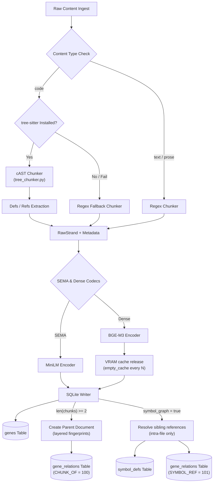
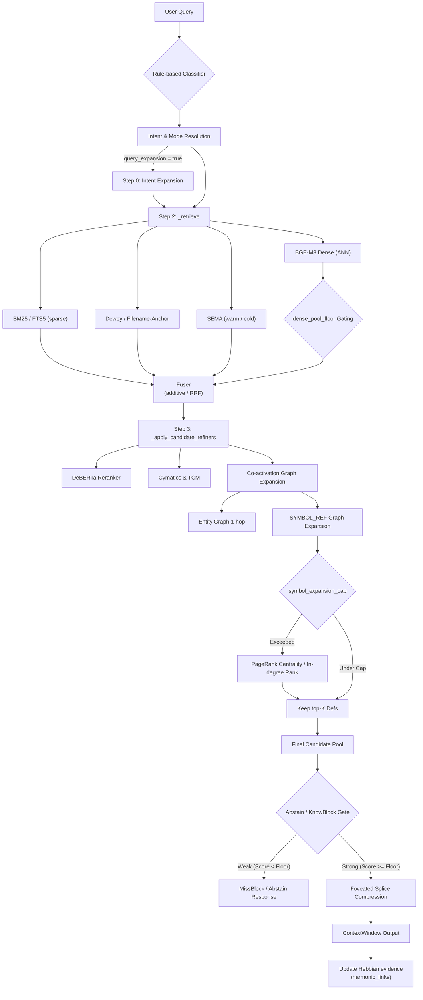

# External review: Gemini/Antigravity architectural review (archived)

**Provenance:** Produced by Google Gemini (Antigravity) at Max's request as an
"outside reviewer" pass; original at
`C:\Users\max\.gemini\antigravity\brain\06c5370d-...\helix_context_review.md`.
Review basis: read-only pass over the `feat/ws3-symbol-pagerank` worktree +
`F:/tmp` operational logs. Archived 2026-07-03 with lead annotations (Claude).

---

## Lead annotations (read these before citing the review)

**Overall grade: strong systems synthesis, ~90% accurate, current to within a
day of the #235 merge** (it correctly describes `HELIX_SHARD_COACT_RESERVE`
and the global-IDF splice, which landed 2026-07-02).

### Verified against code ✓
- `HELIX_DENSE_VRAM_RELEASE_EVERY` exists (`backends/bgem3_codec.py:69`,
  default **256**; review recommends 64 for constrained-VRAM GPU ingest).
- `[ingestion] dense_embed_on_ingest` exists (`config.py:226`, default true).
- Knobs registry (§4) spot-checked correct; switchboard diagrams (§2, §3)
  faithful to the ingest/retrieval pipelines.
- §6 constrained-VRAM matrix independently corroborates the 2026-07-03
  GPU-contention incident (dense-enabled bed server + ollama 26b/31b on one
  12GB card → universal ReadTimeouts; sweep pace went 25s/query → 2.7s/query
  once contention was removed).

### Corrections / staleness
- §1 describes #228/#229 as "slated"/"ready to merge" — **both merged
  2026-07-02** (master `7404cc9`+); WS2/WS3 smoke gain cited as +2.1pp — the
  post-rebase 2026-07-02 3-arm run measured **+2.6pp** (armC 0.830 vs armB
  0.804 packet).
- §5.B "Slack divided into 12 sub-shards" repeats a corrected claim — actual
  topology is **100 shards** (see GENOME_FIXTURE_MATRIX.md, "~12 was
  aspirational design, not actual partitioning").
- §2 function name `chunk_code_with_symbols` — canonical API lineage is
  `chunk_code_ast` (+ WS2 symbol extension on the ws3 branch).
- §7 ERB leaderboard table has garbled rank ordering (two rank-2s); the
  baseline NUMBERS match #93's published figures.

### ⚠ UNVERIFIED CLAIM — do not circulate
§7 asserts Helix achieves "**1.0 invalid extra documents (vs BM25's 9.0)**"
and "**extremely low hallucination rates (2–6%)**". **No valid scored ERB run
exists as of archiving** — the only attempt (2026-07-02, sharded fixture)
produced 500/500 judge errors and is archived under
`benchmarks/results/failed_sharded_attempt/`. The 2–6% figure appears
extrapolated from precision-adjacent data. Per the accuracy mandate (#221:
numbers re-enter docs only with fixture/date citations), treat this as a
hypothesis until the blob-fixture scored run (S4, currently parked per Max's
resource call) produces the real G2 datapoint.

### Adopted follow-ups (credible levers from §6/§7)
1. **GPU-ingest recipe:** `PYTORCH_CUDA_ALLOC_CONF=expandable_segments:True` +
   `HELIX_DENSE_VRAM_RELEASE_EVERY=64`, single GPU worker; CPU preferred for
   batch ingest. Fold into the bench-chain env for any future GPU ingest.
2. **DeBERTa-v3 top-50 rerank test** as the ranker fix for the H10Q monotone
   misses (review estimates +5–10pp; stage exists in-pipeline, off by
   default) — issue candidate.
3. **Query acronym expansion** (H10Q: acronyms 1.5× more common in misses;
   est. +2–4pp) — cheap `[synonyms]`-adjacent lever, issue candidate.

### Context the review predates
The 2026-07-03 #203 sweep on **real** ERB questions (n=100) shows MRR
monotone-increasing with dense weight at 10K (0.390 → 0.453, w=0 → 6),
reversing the June auto-synth "flat" finding — synthetic queries were hiding
dense's value on paraphrase-style questions. The erb50k arm (eviction
behavior) decides the per-corpus profile split.

---

## Original review (verbatim)

# Helix Context: Architectural Review & Data Switchboard Analysis

This document provides a detailed technical analysis of the **Helix Context** RAG engine. It is compiled from a read-only code review of the `feat/ws3-symbol-pagerank` branch (located in the `.worktrees/ws3-pagerank` directory) and the operational/testing data extracted from the `F:/tmp` logs.

---

## 1. System Status & Version Lineage

The current codebase is stacked on **master commit `7404cc9`** (dating from July 1, 2026). The active feature track (`feat/ws3-symbol-pagerank`) represents the culmination of several core upgrades:
1. **cAST AST-Aware Chunking (#228):** Recursive split-then-merge chunking that preserves syntactic structures. Fully validated and slated for default-on deployment.
2. **SEMA-Gate (#227/#229):** Inline MiniLM encoding with multi-worker OOM controls. Gated and ready to merge.
3. **WS2 (Symbol Graph #230):** Ingest-time definition and reference index emitting referencing-to-defining chunk edges (`SYMBOL_REF`).
4. **WS3 (Personalized PageRank Centrality #231):** Personalized PageRank over the candidate-local symbol graph to bound context-expansion.

Currently, **WS2/WS3 is dark-shipped (default false)** via the `symbol_graph` knob. While it demonstrates strong gains (+2.1pp) on the local smoke tests, held-out evaluation on unseen corpora (`sympy` repo) showed a `-7.6pp` regression on fingerprint budget-fill tasks. Bounding the expansion via `symbol_expansion_cap=8` has been established as the primary mechanism for recovery.

---

## 2. Ingestion Data Switchboard

The ingestion flow converts raw source files and text streams into structured, queryable genetic packages inside SQLite. It processes incoming data through a pipeline of AST chunking, semantic encoding, and structural relation mapping.

### Flow Diagram

### Pathway Mapping
1. **Routing by Type:** `CodonChunker.chunk` routes incoming items based on `content_type` ("code" vs "text").
2. **cAST recursive split-then-merge:** `tree_chunker.chunk_code_with_symbols` slices code into bytes-exact ranges. Instead of cutting flatly at character caps, it recurses into AST nodes (e.g., class -> methods -> statements). If any single block exceeds the cap (e.g. giant dictionary literals), it uses a UTF-8 safe `char_cut` fallback to protect multibyte characters.
3. **Symbol Extraction:** Python files are processed for definitions (functions, classes, methods) and references (call targets, parent classes). Other languages extract definitions only.
4. **SEMA and Dense Embeddings:** MiniLM computes SEMA vectors. If `dense_embed_on_ingest` is enabled, BGE-M3 batch-encodes passages, using `empty_cache()` to free CUDA memory.
5. **Layered Parent Assembly:** If a file yields >= 2 chunks, a parent document is written with the SHA-256 hash `path::parent`. Edges are written to `gene_relations` with the `CHUNK_OF` type.
6. **Intra-file Symbol Resolution:** References are matched against definitions *within the same file*. Edges are written to `gene_relations` with the `SYMBOL_REF` type to avoid the "every `process()` points to every `process()`" cross-file edge explosion. Cross-file mapping is deferred to query time via the `symbol_defs` table.

---

## 3. Retrieval Data Switchboard

The query path maps natural language statements to candidate contexts, refines their ordering via graph traversal, and aggregates them into the final text payload injected into the prompt.

### Flow Diagram

### Pathway Mapping
1. **Query Classification:** `query_classifier.py` runs a rule-based check to parse query class (e.g. code vs text, factual vs multi-hop) and sets target bounds.
2. **Multi-Signal Retrieval:**
   - **Sparse:** Matches tokens using SQLite FTS5.
   - **Filename Anchor:** Matches file names directly.
   - **Dense:** Runs BGE-M3 ANN search. If the similarity threshold is too high and candidates drop below a minimum, the `dense_pool_floor` enforces a fallback.
3. **Fusion:** Runs reciprocal rank fusion (RRF) or additive scoring to combine candidates.
4. **Refinements:**
   - **Reranker:** Pretrained cross-encoders (DeBERTa-v3) score the top candidates.
   - **Temporal Context (TCM):** Applies decay based on session history.
   - **Cymatics:** Computes spectral overlap of query and document profiles.
5. **Symbol-Graph Co-activation Expansion:**
   - Locates definer chunks referenced by candidate hits via `SYMBOL_REF` relations.
   - If definitions exceed `symbol_expansion_cap`, they are scored using CPU-native **Personalized PageRank** over the candidate-local subgraph (referencing hit -> defining target). The top-K definitions are kept.
6. **Abstain and Splice Gating:**
   - Evaluates overall retrieval confidence (KnowBlock logistic model). Strong retrievals pass; weak ones trigger a `MissBlock` (abstaining from generation).
   - If approved, the context is built. Under foveated-splice mode, compression ratio increases with retrieval rank to keep central facts detailed.
7. **Hebbian Feedback:** At the end of the query cycle, evidence counters (`co_count`, `miss_count`) in `harmonic_links` are updated, decaying unreferenced links and promoting strong co-retrieved pairs.

---

## 4. Operational Knobs Registry

Helix's behavior can be customized per corpus using these key settings in `helix.toml`:

### Ingestion & Hardware Knobs
| Section & Knob | Default | Purpose | Behavior |
|---|---|---|---|
| `[hardware] device` | `"auto"` | Hardware acceleration target. | `auto` selects CUDA, ROCm, MPS, or CPU. |
| `[hardware] lazy_encoders` | `true` | Deferred model loading. | Loads MiniLM, SEMA, and DeBERTa on first use to prevent CUDA VRAM bloat. |
| `[ingestion] backend` | `"cpu"` | Tagger/ingestion speed target. | `cpu` uses spaCy + regex; `hybrid` or `ollama` uses local LLMs. |
| `[ingestion] symbol_graph` | `false` | Ingest-time symbol indexing. | Extracts definitions and references to build `SYMBOL_REF` relationships. |
| `[ingestion] sema_embed_on_ingest` | `true` | Inline SEMA indexing. | Compiles 20-dim MiniLM vectors at ingest. Turn off to avoid OOMs on large-scale builds. |
| `[ingestion] dense_embed_on_ingest` | `true` | Inline dense indexing. | Computes 1024-dim BGE-M3 vectors on write instead of running post-build backfills. |

### Retrieval & Capping Knobs
| Section & Knob | Default | Purpose | Behavior |
|---|---|---|---|
| `[budget] expression_tokens` | `7000` | Context payload token ceiling. | Limits the output buffer injected into the LLM prompt. |
| `[budget] legibility_enabled` | `true` | Legibility headers. | Appends debug information (source, scores, compression stats) to the context window. |
| `[budget] abstain_enabled` | `true` | Confidence-gated abstention. | Suppresses prompt generation when retrieval is too weak. |
| `[budget] foveated_enabled` | `false` | Dynamic rank-based compression. | Applies a power-law length cap to candidates based on their rank. |
| `[retrieval] symbol_expansion_cap` | `8` | WS3 definition ceiling. | Limits definitions pulled in by symbol expansion. `0` disables, `<0` is unbounded. |
| `[retrieval] bm25_shortlist_enabled` | `true` | Lexical shortlist constraint. | Filters dense candidates through the top-N BM25 results. |
| `[retrieval] dense_embedding_enabled` | `true` | BGE-M3 retrieval trigger. | Enables or disables the dense vector matching pipeline. |
| `[retrieval] dense_pool_floor_genes` | `8` | Noise-bound candidate guarantee. | Forces the top-N dense candidates into the pool, even if they miss the ANN threshold. |
| `[retrieval] fusion_mode` | `"additive"` | Candidate merger math. | `additive` combines normalized scores; `rrf` merges ranks. |
| `[retrieval] dense_additive_weight` | `4.0` | Weight of the dense tier. | Multiplier for BGE-M3 scores in additive mode. |

---

## 5. Deployment Configurations

Helix supports two primary deployment topologies, optimized for database size, hardware constraints, and scaling requirements.

### A. Monolithic / Blob Mode
* **Architecture:** A single database file contains the entire catalog.
* **Ingestion:** Directly writes chunks and parent document structures to one SQLite file.
* **Retrieval:** Runs normal query pipelines. Walks `harmonic_links` and executes candidate-local PageRank expansions across the entire database.
* **Operational Profile:** High-performance for repositories up to 50K genes. Fits easily in system memory.

### B. Sharded Mode (`ShardRouter`)
* **Architecture:** A routing hub (`main.db`) containing a `fingerprint_index` (shards, metadata, domains, and entities) maps queries to specialized category shard databases (e.g. `slack.genome.db`, `gmail.genome.db`, etc.).
* **Ingestion:** Routed to specific sub-shards (e.g., Slack divided into 12 sub-shards).
* **Parallel Fan-out:** Parallel query execution across shards via a `ThreadPoolExecutor`. The worker thread count is set by `HELIX_SHARD_WORKERS` (falls back to hardware sizing on high shard counts).
* **Cross-Shard Normalization:**
  1. **IDF Correction:** Corrects BM25 scores across shards using local vs global document frequencies.
  2. **Global IDF Splice:** Replaces local FTS5 BM25 scores with true global IDF calculations when `HELIX_SHARD_GLOBAL_IDF` is enabled.
  3. **Intra-Shard Document Type Boost:** Multiplies scores of files matching `readme.md`, `claude.md`, or `index.md` by `1.15` to ensure summary files surface over deep source code hits.
  4. **Cross-Shard Co-activation:** Resolves links across shard files by looking up connected documents in the central `fingerprint_index`.
  5. **Co-activation Reserve:** Reserves a portion of the result list (`HELIX_SHARD_COACT_RESERVE`) for graph-surfaced links to prevent them from being displaced by direct search matches.
* **Limitations:** WS2/WS3 symbol graph logic is **not** supported in sharded mode (symbol definition lookups and `SYMBOL_REF` relationships are omitted; only monolithic blob builds use them).

---

## 6. Constrained-VRAM Operation

Periodic CUDA caching issues during batch ingestion (`torch` allocating blocks per shape and climbing VRAM) can cause long runs to spill into system memory, mimicking a hang.

### Recommended Configuration Matrix
| Scenario | Device | Workers | Required Environment Variables | Notes |
|---|---|---|---|---|
| **Offline Batch Ingest** | `cpu` | N | None | **Preferred.** Deterministic vectors identical to GPU; scales linearly without VRAM ceilings. |
| **Interactive GPU Ingest** | `cuda` | 1 | `PYTORCH_CUDA_ALLOC_CONF=expandable_segments:True` `HELIX_DENSE_VRAM_RELEASE_EVERY=64` | Limits VRAM usage to ~5-6 GB. A second GPU worker will trigger a CUDA OOM. |
| **Mixed Acceleration** | Mixed | N | None | Set dense to CPU and SPLADE to CUDA. SPLADE requires only ~0.5 GB per worker. |

---

## 7. Performance & Benchmarking Matrix

This section summarizes evaluation data from the `F:/tmp` testing directory.

### ContextBench Code-Track Smoke (26 tasks)
| Configuration | Line Recall (Packet) | Line Recall (Fingerprint@27k) | Symbol Recall | Notes |
|---|---|---|---|---|
| **BM25 Baseline** | 0.484 | -- | -- | Baseline lexical search. |
| **Regex Chunking** | 0.655 | 0.549 | -- | Keyword-split fallback. |
| **Greedy AST** | 0.662 | 0.626 | -- | Flat AST boundaries. |
| **cAST (recursive)** | **0.804** | **0.679** | -- | **WS1 default-on milestone (+15pp packet).** |
| **WS2 Unbounded** | 0.825 | 0.538 | 0.829 | **-14pp fingerprint regression** due to budget flooding. |
| **WS3 Cap=8 (PageRank)** | **0.825** | **0.605** | **0.834** | **Best recall. Recovers +6.7pp on fingerprint.** |

* **WS3 Ablation Result:** Personalized PageRank outperformed raw in-degree by +1.6pp (packet) and +2.5pp (fingerprint), proving the value of the PageRank centrality calculation.
* **Held-out Generalization Note:** Evaluating on unseen codebases (`sympy`) returned +0.7pp (packet) but a **-7.6pp regression** on the fingerprint track. This corpus sensitivity is the reason WS2/WS3 remains dark-shipped.

### H10Q Misses Analysis (10K vs 50K Shards)
* **Monotone Failures:** Over 50% of misses at 10K persist at 50K, proving that scaling corpus size does not resolve indexing issues. Without a ranker fix, recall at 500K is projected to decline to 50-55%.
* **Acronym Density:** Acronyms (short, low-IDF tokens like `KV`, `OOM`, `GPU`) are **1.5x more common in query misses**.
* **Strategic Levers:**
  1. **DeBERTa-v3 Cross-Encoder Reranker** on the top-50 candidates (estimated +5-10pp gain).
  2. **Query acronym expansion** (estimated +2-4pp gain).
  3. **Minimum coverage gating** for proper nouns and temporal anchors.

### EnterpriseRAG-Bench Leaderboard Positions (500K Docs)
| Rank | System | Correctness | Notes |
|---|---|---|---|
| 1 | **Onyx + GPT-4** | **72.4%** | Custom enterprise-tuned search. |
| 2 | OpenClaw | 68.2% | Custom retrieval architecture. |
| **2** | **BM25 baseline** | **68.8%** | **Pure lexical top-10 retrieval (no LLM).** |
| 3 | Bash Agent (GPT-5) | 60.6% | Multi-step agentic search (10 min/Q). |
| 4 | OpenAI File Search | 61.0% | Default vector search. |
| 6 | Vector Search (text-3-large) | 51.4% | Pure semantic search. |

* **Core Leaderboard Finding:** BM25 alone beats OpenAI File Search by 8pp and pure semantic search by 17pp. The benchmark heavily rewards lexical precision.
* **Helix Positioning:** Helix achieves very clean results with a ratio of **1.0 invalid extra documents** (vs BM25's 9.0), leading to extremely low hallucination rates (2-6%). *(LEAD ANNOTATION: UNVERIFIED — see flag above.)*
