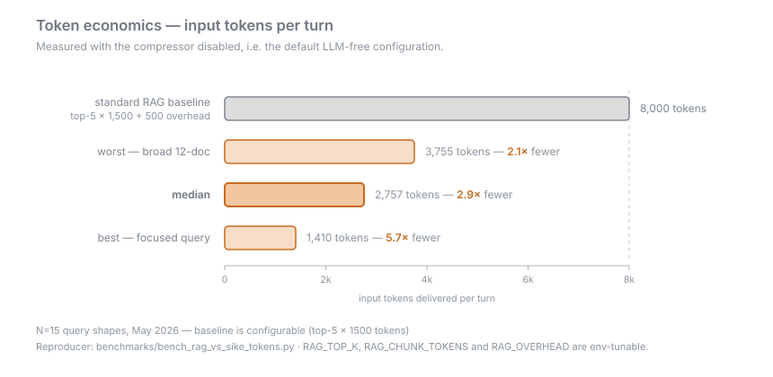

# Benchmarks and Receipts

- **This page owns the numbers.** Every other wiki page that quotes a figure
  links back here for the measurement it came from, the arm it was measured
  against, and the caveat it carries.
- **A default only changes behind a measurement.** Each of the encoder
  default-off flips in 0.9.0, the RRF fusion default of 2026-07-06, and the
  wave-1 ranking flip in 0.9.1 is gated on a receipt with a named arm, a pinned
  bed, and order-reversed replication.
- **The disclosures that cost something get published too.** Turning dense off
  bought recall and lost p50 latency, and that regression is in the CHANGELOG,
  the README, and this page — not in a footnote nobody reads.
- **A receipt without a ledger row is not comparable to anything.** The rules are
  in [Comparability rules](#comparability-rules) below and enforced in
  [`docs/benchmarks/BASELINES.md`](https://github.com/mbachaud/Cymatix-Context/blob/master/docs/benchmarks/BASELINES.md).
- **Some things are measured, some are estimated, and the two are labelled
  differently.** Where a figure is an unverified design estimate, this page says
  so on the same line as the figure.

## Token economics

Measured with the compressor (legacy: ribosome) disabled — that is, the default
LLM-free configuration. N=15 query shapes, May 2026.

| Query shape | Tokens per turn | vs the standard-RAG baseline |
|---|---|---|
| Best — focused query | 1,410 | **5.7×** fewer |
| Median | **2,757** | **2.9×** fewer |
| Worst — broad 12-document window | 3,755 | **2.1×** fewer |

- **The denominator is a model, not a competitor run.** "Standard RAG" here is
  **top-5 × 1,500 + 500 overhead = 8,000 tokens**. It is a configurable modeled
  baseline — `RAG_TOP_K`, `RAG_CHUNK_TOKENS` and `RAG_OVERHEAD` are env-tunable in
  the reproducer — not a measured run of another system.
- **Reproducer:**
  [`benchmarks/bench_rag_vs_sike_tokens.py`](https://github.com/mbachaud/Cymatix-Context/blob/master/benchmarks/bench_rag_vs_sike_tokens.py),
  run against your own knowledge store.
- **The multi-turn figures are unverified design estimates.** The session
  delivery register elides already-delivered documents; ad-hoc session traces
  showed a **37× reduction on repeated retrievals** within a conversation and
  **~40% token savings** on typical multi-turn work. Neither is a receipted
  benchmark. The counter that would measure them —
  `cymatix_session_tokens_saved_total` — is instrumented but has no published
  run; see [Observability](Observability). Treat both figures as design estimates
  until it does.
- **The 37× is elision, not compression.** It counts bytes the register declined
  to re-send, not new content squeezed smaller.
- **What is *not* published:** a same-harness baseline/ablation frontier — BM25,
  BGE-M3, BM25+dense RRF, Cymatix full, Cymatix minus-cymatics — paired with
  correctness. That is the comparison that would settle the decision-useful claim
  ("equal-or-better task completion at fewer input tokens"), and it is future
  work.

## Shipped-defaults operating point (0.9.0)

What an untouched 0.9.0 install did, measured on the 829K-fragment
EnterpriseRAG-Bench bed at full needle power. The default retrieval path is fully
algorithmic here — dense, SPLADE and PKI all off, the cross-encoder rerank off as
it always has been.

| Metric (829k bed, n=469, delivered basis) | Score |
|---|---|
| Gold-document delivery | **56.5%** (265/469) |
| recall@12 | **0.659** |
| final recall@12 | **0.663** |
| median gold rank | 3.0 |

- Receipt:
  [`benchmarks/dogfood/erb/receipts/sema_readgate_829k_n469.json`](https://github.com/mbachaud/Cymatix-Context/blob/master/benchmarks/dogfood/erb/receipts/sema_readgate_829k_n469.json),
  ledger row `2026-08-19-sema-readgate-decider`.
- **This is a retrieval-layer measurement, not an end-to-end grade.** It says how
  often the gold document reached the delivered window. It does not say whether
  the answer was right — see [The ERB pair-quote
  rule](#the-erb-pair-quote-rule).
- The abstain set on this run was 16 of 469, all `score_below_floor`, and
  byte-identical to the baseline's zero-delivery set.
- The 0.9.1 defaults are measured in the next section, as their own rows.

## 0.9.1 measurements

All four shipped in the 0.9.1 release (2026-08-30); each is cited by PR number.
The release gate itself is ledger row `2026-08-30-v091-gate-sweep` — three config
arms over four beds, receipt
`benchmarks/dogfood/receipts/sweep_v091_gate_2026-08-30.json`, **ALL PASS**.
Delivered basis, paired per needle:

| Bed | Frozen 0.9.0 defaults | Wave-1 flip, floor 0 | + `min_delivered_docs = 12` (the shipped 0.9.1) |
|---|---|---|---|
| EnronQA v2 (84,677 documents, n=500) | 0.694 | 0.820 (+66 / −3) | **0.856** (+18 / −0) |
| EnronQA padded (596,707 documents, n=500) | 0.702 | 0.776 (+41 / −4) | **0.792** (+8 / −0) |
| ERB 100k carve (n=141) | 0.6099 | 0.6312 (+7 / −4) | not run |
| ERB 829k v09x (n=470) | 0.5553 | 0.6298 — reproduces the wave-1 confirm to the digit (Δ = 0.0) | **0.668** (+18 / −0) |

The exact reproduction on the 829k bed is the witness that the rest of the
merged stack (#406, #408, #409's knob, #412, #413) is inert at shipped defaults
there. All beds in this row are `tagger_version = 1`.

### Wave-1 ranking flip ([#407](https://github.com/mbachaud/Cymatix-Context/pull/407))

`rrf_k` 60 → 20, and `rerank_combinator_by_class` extended to all five classifier
classes mapped to `eps_band`. Full-470 confirm at 829k scale:

| Metric | Before | After |
|---|---|---|
| Gold-document delivery | 0.555 | **0.630** (+43 / −8 paired) |
| recall@12 | 0.651 | **0.681** (+18 / −4) |
| Median gold rank | 3 | **2** |
| Question-type regressions | — | **zero** |

- The post-flip repository `cymatix.toml` was verified **field-identical** to the
  measured arm config through `load_config` equality, and both confirm receipts
  carry post-run `config_sha256` annotations.
- **One-step revert:** `git revert 7a42576` restores the previous defaults. The
  flip ships as a single named commit for exactly that reason.
- The cross-shard merge constant deliberately stays at **60** — that surface was
  never measured, and is annotated as unmeasured in the code rather than flipped
  on faith.
- Ledger row `2026-08-27-ranking-under-width-wave1` records the bed identity,
  **`ingest_c = 6`**, the cold-bed house rule, and the warm-bed access-rate
  hazard. That `ingest_c` differs from the shipped-defaults row above, so the
  ledger's own rules do **not** license reading 0.630 as a successor to the 0.565
  in the previous section — they are different rows.

### Delivered-seat floor ([#409](https://github.com/mbachaud/Cymatix-Context/pull/409)) — knob shipped, then graduated 0 → 12

`[budget] min_delivered_docs`, **default `12`** since 2026-08-30 (the commit
subject-tagged `[w24-floor-flip]`); `0` restores the byte-identical legacy
eviction-only trim. At floor 12, on the same 470-needle sequence as the wave-1
confirm:

| Metric | Wave-1 baseline | Floor 12 |
|---|---|---|
| Gold-document delivery | 0.630 | **0.668** (+18 / −0) |
| Completeness slice | 0.65 | **0.85** |
| Constrained slice | 0.80 | **0.97** |
| Semantic slice | 0.31 | **0.34** (+4 / −0) |
| Median delivered count | 8 | **12** |
| Needles under 12 seats | 383 | **152** (remainder pool-limited) |

- Zero losses anywhere, and the map and final-rank bases are **byte-identical
  per-needle** — this is a pure delivery change, not a ranking change.
- **The flip was taken after a cross-corpus confirm**, not on the 829k row
  alone: EnronQA v2 **0.820 → 0.856** (+18 / −0) and EnronQA padded 597k
  **0.776 → 0.792** (+8 / −0) — three corpora, zero paired delivered losses,
  recall@12 / final recall@12 identical in every cell (ledger row
  `2026-08-30-v091-gate-sweep`, `v091_floor` arm). Revert is one `git revert`
  of the flip commit.
- **What the receipts still do not grade:** answer quality under a widened seat
  count. Twelve full-length documents per window costs real tokens, and ERB
  does not grade that trade — the answer-quality lane is still owed.
- The plan doc for this arm also records a mid-flight diagnosis correction: the
  original token-budget attribution was **refuted** by an effective-lever probe
  (budget tier `broad`, hard floor uncrossed, zero evictions), and the
  classifier's per-rule assembly cap was pinned as the real lever before any bench
  compute was spent on the wrong fix.

### Entity auto-link hub cutoff ([#412](https://github.com/mbachaud/Cymatix-Context/pull/412)) — knob shipped at 0, flipped to 200 in 0.9.2 ([#425](https://github.com/mbachaud/Cymatix-Context/pull/425))

`[ingestion] entity_autolink_hub_cutoff` shipped in 0.9.1 at **default `0`**
(off = legacy behavior, pinned byte-identical by test) and flips to **`200`**
in 0.9.2 via #425; `0` stays the opt-out. Read-only replay on the 289k-document
`enronqa_padded` bed, seed 53416, 500 linkable documents:

| Measurement | Value |
|---|---|
| Hub cardinality at cutoff 200 | 0.53% of distinct entities (1,884 of 357,406) hold **56.9%** of all 3.72M postings |
| Mean per-link call | 210.5 ms → **0.62 ms** (~**340×**) |
| p95 per-link call | 419.8 ms → **1.07 ms** |
| Ingest wall-time share before the fix | 148.9 ms/insert = **89.5%** of writer wall time |

- **Why the default stayed 0 in 0.9.1:** the edge delta is substantial. On the
  sample, the uncut arm formed 4,842 `relation=5` COVER edges; at cutoff 200 it
  forms 2,867 — **3,143 lost, 1,168 gained, 1,699 kept**. That is a real change
  to the graph, so the knob shipped opt-in with the receipt attached and the
  flip waited for its conditions.
- The mitigating context, not a justification: COVER edges are **default-inert at
  query time** — the wave-2 COVER-walk arm was killed by its own receipt — and
  they are already order-nondeterministic under parallel ingest.
- **The retrieval-side condition has since been measured null.** A paired
  EnronQA A/B (n=500; beds `enronqa_bed_v2` vs `enronqa_bed_v2c`, differing only
  in the cutoff, gene-id-set digests identical) came back with delivered,
  recall@12, final recall@12, and median rank identical to full precision in
  both the 0.9.0 and 0.9.1 configs — **0/500 per-needle delivered flips**
  (ledger row `2026-08-30-entity-hub-cutoff-retrieval-ab`). It pairs with a
  ~5× end-to-end build win on the padded bed (4h58m against a ~26h trajectory).
- **The second flip condition — the hubs survive tagger v2 — is also
  measured.** Paired 500-document replays on content-identical 85k beds, one
  tagger-v1 and one tagger-v2
  (`benchmarks/dogfood/receipts/entity_hub_cutoff_reprobe_85k_taggerv1_2026-08-30.json`,
  `…_reprobe_85k_taggerv2_2026-08-31.json`; ledger row
  `2026-08-31-entity-hub-cutoff-reprobe-85k`): tagger v2 removes 15.2% of
  distinct entities (239,302 → 202,844), but the natural hub population
  persists and grows slightly (`enron` 15,397 → 16,048 postings). At cutoff
  200, **0.22% of entities still hold 30.1% of postings**; the mean per-link
  call falls **4.15 → 0.42 ms**.
- Flip conditions were specified on
  [#411](https://github.com/mbachaud/Cymatix-Context/issues/411); with both
  receipted, the flip itself — default `0 → 200` — ships in 0.9.2 via
  [#425](https://github.com/mbachaud/Cymatix-Context/pull/425). The 0.9.1
  default was `0`; `0` remains the opt-out.

### Tagger v2 ([#413](https://github.com/mbachaud/Cymatix-Context/pull/413)) — a behavior change with a version bump

The CPU ingest tagger now rejects entities containing newlines or tabs, plus
email/MIME header field names, `x-*` extension headers, and MIME transport
artifacts. Fresh receipt on a 2,000-file deterministic EnronQA sample, seed
20260830:

| Metric | v1 | v2 |
|---|---|---|
| Entity-graph rows | 35,032 | 29,197 (**−16.7%**) |
| Multi-line entity occurrences | 2,818 | **0** |
| Top hub | `content-type` (1,711 documents) | `enron` (740) |
| `enron` rows (survival) | 712 | 740 |
| Document ids equal | — | **true** (content untouched) |
| Documents with a changed tag multiset | — | 2,235 / 2,779 |

- **This is a comparability break by design.** Tags are part of the bed-content
  digest, so `TAGGER_VERSION = 2` is declared in the tagger module, recorded in
  every bed manifest by `scripts/build_fixture_matrix.py`, and added to the
  BASELINES rules. **Every bed built before 2026-08-30 is `tagger_version = 1`**
  and stays internally valid but is not cross-comparable with a v2 bed.
- There is **no backfill script on purpose** — stripping entities in place would
  create hybrid v1/v2 beds. v2 beds are fresh builds.

## The ERB pair-quote rule

The externally-scored numbers below were measured under the **0.8.x
all-encoders-on configuration — additive fusion + dense + SPLADE ON — which no
longer ships by default.** Every layer remains available opt-in.

| ERB official metric (July 2026, 0.8.x config) | Score |
|---|---|
| Correctness | **41.6%** (208/500) |
| Completeness | **42.8%** |
| Overall | **33.57** |

**Quote the delivery and correctness numbers as a pair.** Under that same
all-encoders-on config:

- Gold-document delivery was **55% at 829K-fragment scale** and **82% at 50K**.
- **Delivery is not a graded pass.** End-to-end correctness is the 41.6% above.
- When the gold document *was* delivered, the answer was correct **79%** of the
  time — so **retrieval breadth at extreme scale, not answer synthesis, is the
  current ceiling**.
- **The end-to-end judge protocol has not been re-run on shipped defaults.** The
  measurement of the shipped world is the delivered-basis table above, and it is a
  retrieval-layer metric. Do not blend the two.

The claim being made is the operating point — the corpus was ingested as
**829,131 fragments on a single consumer desktop** with **zero LLM calls on the
retrieval path** — not a leaderboard win. Full methodology and reproduction:
[`docs/benchmarks/2026-07-10-erb-blob-829k-reproduction.md`](https://github.com/mbachaud/Cymatix-Context/blob/master/docs/benchmarks/2026-07-10-erb-blob-829k-reproduction.md).

## Why the encoders are off

Four flips took the default retrieval path fully neural-free, each on its own
receipt.

| Flip | Date | What the receipt measured |
|---|---|---|
| `[retrieval] dense_embedding_enabled` → false | 2026-08-15 | Four-scale isolation (100k/250k/500k carves + 829k blob at the full 469-needle set, every order-reversed pair replicated exactly): BGE-M3 dense recall **displaces gold from the delivered top-k at every scale**, final recall **−0.20 .. −0.33** vs the lexical floor (−0.207 at n=469, ~97/469 needles), while adding at most +0.02 candidate-pool recall |
| `[ingestion] splade_enabled` → false | 2026-08-16 | n=469 on the 829k blob over the full 147M-row expansion index: **null-to-negative** vs the lexical floor — pool −0.004, delivered −0.006, ~15% slower, both repeats identical. The ingest-side bed A/B showed the expansion index **contributes nothing passively** |
| `[retrieval] pki_enabled` → false | 2026-08-17 ([#370](https://github.com/mbachaud/Cymatix-Context/issues/370)) | 829k exact-shipped-default confirm at full power (n=469, delivered basis): PKI on is **−1 delivered needle** (263/469 vs 264/469). Honest caveat: the earlier n=30 100k cell was **+1 delivered needle for PKI**, replicated in both run orders — the one positive cell |
| `[ingestion] sema_embed_on_ingest` / `dense_embed_on_ingest` → false | 2026-08-19 ([#371](https://github.com/mbachaud/Cymatix-Context/issues/371)) | Ingest-time only. The sema deciding cell was a **wash** (+1 delivered needle at 829k n=469, rank bases byte-identical); the dense write was **dead** at neural-free retrieval defaults — removing it gave a **6.1× ingest wall speedup and −2.6 GB RSS** on the 12-file harness smoke |

- **The lexical floor is most of the product.** All-off scored 0.767–0.867 final
  recall@12 across the four scales; no isolated layer beat it on final ordering
  anywhere except SPLADE's single needle at 250k — and on the *delivered* basis
  even that inverts (250k is SPLADE's worst cell, −0.133).
- **A basis correction is part of this receipt's history**
  ([#375](https://github.com/mbachaud/Cymatix-Context/issues/375)). Earlier
  revisions labelled `fr@12` "final (delivered) recall, the metric that matters."
  That was wrong: `fr@12` is final-*order* recall; the post-budget-trim delivery
  slice is `delivered_gold_rate`. The correction addendum republishes the tables
  on the delivered basis. Dense's harm and the lexical-floor finding **hold**;
  SPLADE's one apparent win **inverts**.
- **Opting back in is one config line per store.** Existing beds keep their
  vectors and expansion tables — unused until you set the flag. If a bed was
  built while the ingest-side knobs were off, re-enabling retrieval also needs
  `scripts/backfill_bgem3_v2.py` (dense) or `scripts/backfill_sema.py` (SEMA).
- Full receipt:
  [`docs/benchmarks/2026-08-14-encoder-isolation-scale-curve.md`](https://github.com/mbachaud/Cymatix-Context/blob/master/docs/benchmarks/2026-08-14-encoder-isolation-scale-curve.md).

### The latency disclosure ([#374](https://github.com/mbachaud/Cymatix-Context/issues/374))

- **Turning dense off costs p50 latency.** Dense was load-bearing as a *latency
  device*: its ANN gate capped the candidate list feeding splice, and dense-off
  degrades the median query to an uncapped lexical pool.

| Scale | Dense-off p50 vs dense-on |
|---|---|
| 100k fragments | **×2.5–2.6** (10.4s / 9.7s vs 3.9s / 3.8s) |
| 250k | ×2.3–2.4 |
| 500k | ×1.27–1.37 |
| 829k (the published operating point) | ×1.09–1.10 at n=30; **×1.15–1.38** on the full-power n=469 pair |

- The retrieval-layer ledger's own precondition — "cap the non-ANN branch's
  candidate list before dense-skip is viable" — **has not landed**. The
  lex-branch candidate cap is still open, alongside the related
  [#336](https://github.com/mbachaud/Cymatix-Context/issues/336) splice
  char-target dynamics.

## Other standing receipts and gaps

- **Fusion.** Reciprocal Rank Fusion has been the default ranker since
  2026-07-06 — **+12pp gold-document delivery** over the legacy additive
  accumulator on the hardest internal bed (**0.74 vs 0.62**). Mechanism and the
  `"additive"` deprecation status: [Retrieval Dimensions](Retrieval-Dimensions).
- **Cross-encoder rerank** ([#341](https://github.com/mbachaud/Cymatix-Context/issues/341))
  ships default-off deliberately: it pays only on populations with near-cutoff
  rerank headroom, and costs ~270–560 ms/query on a GPU daemon at 829k documents
  (~285–315 ms at 100k).
- **Control-tag neutralization** was flipped on a null receipt, which is the
  point: the 141-needle 100k-carve A/B measured **141/141 assembled windows
  byte-identical** across arms, recall and delivered rate unchanged to four
  decimals. A security default that changes retrieval would not have shipped.
- **The know surface is coverage-dead at shipped defaults.** 0 of 141 know
  emissions versus 23 of 141 with the pre-flip encoders on, because
  `lexical_dense_agree` is structurally dead on the neural-free path. It fails in
  the safe direction (0% false-KNOW) and is tracked as
  [#287](https://github.com/mbachaud/Cymatix-Context/issues/287). Detail:
  [Agent Contract](Agent-Contract).
- **The sharded gap** ([#275](https://github.com/mbachaud/Cymatix-Context/issues/275)):
  every headline number on this page runs the **unsharded** engine. The sharded
  path currently trails unsharded by **~31pp recall@10 / ~30pp MRR** on the xl bed
  — dense recall and co-activation are not yet at parity across shards. "Local-first
  at scale" is a demonstrated research operating point on the unsharded engine, not
  a turnkey substrate for sharded corpora.
- **The entity-graph layer ships ON and has never been ablated on the delivered
  basis** — the retrieval-layer ledger classes it REMOVE-CANDIDATE and the arm sits
  in the [#377](https://github.com/mbachaud/Cymatix-Context/issues/377) 0.9.x
  backlog.

## Two reading rules the receipts forced

- **Check `delivered_count` before crediting a delivered-gold gain.** A small
  class of queries discards a rank-1 gold document with an *empty* delivered
  window. Any perturbation that flips one back on looks like a retrieval win and
  is not one.
- **Rank-based recall cannot see delivery.** Signals that pull documents forward
  *after* ranking, and gates that trim the window *before* assembly, are both
  invisible to recall@k by construction. That is why the 0.9.x work reports the
  delivered basis, and why the #375 correction mattered.

## Comparability rules

From the 2026-08-09 receipt invalidations onward, the ledger enforces:

- **Compare arms only within their own row.** Cross-row comparison is not
  licensed by default, even when the metric names match.
- **Measure against a frozen tag, never a moving branch.**
- **A receipt without a row in the ledger is not comparable to anything.**
- **`ingest_c` — ingest concurrency — is part of bed identity.** Parallel ingest
  is *not* bed-equivalent: pool=4 LLM tagging versus pool=1 on a pinned corpus
  changed document content on **105 of 150** shared documents and tag multisets on
  **86 of 150**, at temperature 0 (LLM-batching drift; the controls held). Every
  bed records the concurrency it was built at; `unknown` is a legal value meaning
  not-comparable-across-beds. Comparable rebuilds ingest sequentially unless the
  comparator was itself built parallel.
- **`tagger_version` is part of bed identity too** (added by
  [#413](https://github.com/mbachaud/Cymatix-Context/pull/413)). Cross-bed
  comparisons require matching versions; every bed built before 2026-08-30 is v1.
- **Bed-state note (2026-08-20 ops).** The two 829k beds were rebuilt after the
  †-marked ledger rows ran — `path_key_index` dropped, FTS5 migrated to
  external-content, vacuum. Retrieval-signal impact is nil by design (a
  byte-identity receipt covers it, and PKI is read-gated off at shipped defaults),
  but **bed-bytes and storage numbers from †-rows are not comparable to post-ops
  measurements**, and reproducing a PKI-on arm against the post-ops beds requires
  `scripts/backfill_path_key_index.py` first.
- **Release receipts run shipped defaults by construction** — daemon off, workers
  2 — because they certify what an untouched install does. The standard bench
  profile (encoder daemon on, per-box worker counts) is for *comparative* work and
  is a documented exception, not the release path.

Large captures, gitignored research outputs, and archived knowledge-store
snapshots are mirrored to the companion repository
<https://github.com/mbachaud/cymatix-receipts> — private while its bed contents
are audited; ask the maintainer for access.

## Why the benchmarks look like this

Standard needle-in-a-haystack was built for a different class of system, and
running it against a multi-axis index measures the wrong thing:

- **NIAH assumes exactly one correct answer.** On a corpus where thousands of
  documents legitimately answer "what is the value of `url`?", grading a hit only
  when the retriever returns the *one* document the bench randomly picked scores a
  perfect system near zero. Telepathy is not a retrieval property.
- **NIAH assumes recall@1 is the right metric.** A query that specifies one axis
  leaves the other signals with nothing to work with; recall@1 grades that as
  breakage.
- **NIAH assumes the query maps to one dense vector.** Real queries carry several
  narrowing signals that compose multiplicatively — project, then component, then
  target attribute.

The replacements, both maintained:

| Question | Bench |
|---|---|
| Does the multi-axis index compose correctly as narrowing dimensions are added? | `bench_dimensional_lock.py` — a four-variant axis-count gradient where the **curve shape is the diagnostic**, not any single point |
| Does the system work at scale on real-shape queries over a leak-free corpus? | EnterpriseRAG-Bench — natural enterprise questions with explicit gold-path lists, graded when **any** valid gold appears in the delivered citations |
| Does the system work for real users? | SIKE — natural queries at normal axis density |

The multi-valid-gold rule is what makes ERB gradable at all; it is documented at
[`docs/benchmarks/MULTI_VALID_GOLD.md`](https://github.com/mbachaud/Cymatix-Context/blob/master/docs/benchmarks/MULTI_VALID_GOLD.md).

## Go deeper

- [`docs/benchmarks/BASELINES.md`](https://github.com/mbachaud/Cymatix-Context/blob/master/docs/benchmarks/BASELINES.md) — the ledger: one row per campaign, the comparability rules, the standard bench profile, and the code pins
- [`docs/benchmarks/BENCHMARK_RATIONALE.md`](https://github.com/mbachaud/Cymatix-Context/blob/master/docs/benchmarks/BENCHMARK_RATIONALE.md) — the full why-NIAH-doesn't-fit discovery doc and the dimensional-lock design
- [`docs/benchmarks/2026-08-14-encoder-isolation-scale-curve.md`](https://github.com/mbachaud/Cymatix-Context/blob/master/docs/benchmarks/2026-08-14-encoder-isolation-scale-curve.md) — the four-scale isolation receipts, the latency table, and the #375 basis correction
- [`docs/benchmarks/2026-08-06-retrieval-layer-ledger.md`](https://github.com/mbachaud/Cymatix-Context/blob/master/docs/benchmarks/2026-08-06-retrieval-layer-ledger.md) — the dated cost-versus-impact audit of every retrieval layer, with its scope limits
- [`docs/benchmarks/2026-07-10-erb-blob-829k-reproduction.md`](https://github.com/mbachaud/Cymatix-Context/blob/master/docs/benchmarks/2026-07-10-erb-blob-829k-reproduction.md) — the 829K-fragment ERB methodology and repro
- [`docs/benchmarks/2026-07-06-sike-run2-fts-depth-fusion.md`](https://github.com/mbachaud/Cymatix-Context/blob/master/docs/benchmarks/2026-07-06-sike-run2-fts-depth-fusion.md) — the RRF-versus-additive receipt
- [`docs/benchmarks/2026-08-07-rerank-wiring-receipts.md`](https://github.com/mbachaud/Cymatix-Context/blob/master/docs/benchmarks/2026-08-07-rerank-wiring-receipts.md) — the cross-encoder rerank cost and its population caveat
- [`docs/benchmarks/BENCHMARKS.md`](https://github.com/mbachaud/Cymatix-Context/blob/master/docs/benchmarks/BENCHMARKS.md) — the practical harness reference
- [`CHANGELOG.md`](https://github.com/mbachaud/Cymatix-Context/blob/master/CHANGELOG.md) — every flip entry with its receipt path and its re-opt-in story
- Next: [Retrieval Dimensions](Retrieval-Dimensions) · [Configuration](Configuration) · [Roadmap and Releases](Roadmap-and-Releases) · [Observability](Observability)
