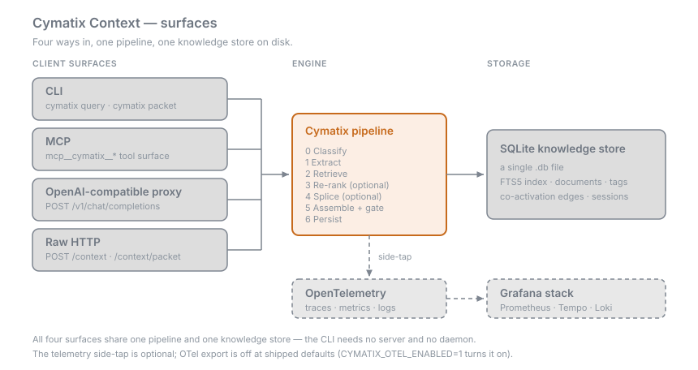

# Cymatix Context

Coordinate-index engine for LLM agents. It retrieves, weighs, and compresses
a corpus into a context window — without a single LLM call on the retrieval
path.

- **Version:** this wiki documents **v0.9.2 branch code**. The v0.9.1
  release was published 2026-08-30 (tag `v0.9.1`, PyPI `0.9.1`). Changes
  are cited by PR number where they appear.
  The Tier-2 lexicon aliases the pages present as canonical
  ([#419](https://github.com/mbachaud/Cymatix-Context/pull/419)) follow the 0.9.1 tag and are not in the 0.9.1 wheel — on that
  wheel the legacy spellings are the ones that resolve. See
  [Roadmap and Releases](Roadmap-and-Releases) for the release contents.
- **Install:** `pip install cymatix-context` (Python 3.11+). Start at
  [Getting Started](Getting-Started).
- **License:** Apache-2.0.

## What it is

- A persistent knowledge store (legacy: genome) — one SQLite file — plus a
  seven-stage retrieval pipeline that assembles a token-budgeted context
  window per turn.
- Four ways in, all over the same retrieval primitives and the same JSON
  shapes: a CLI, an MCP tool surface, an OpenAI-compatible proxy, and raw
  HTTP.
- Every response carries an explicit agent contract: `know { found,
  confidence }` (grounded — you may answer) or `miss { reason, escalate_to }`
  (not found — don't answer from the knowledge store).
- The name comes from the engine's cymatics stage: each term is hashed (MD5)
  into one of 256 bins and given a small Gaussian spread, and query and
  candidate are compared as the resulting 256-dimensional vectors. "Cymatics"
  is a mnemonic for that binned spectrum, not a claim of signal-processing
  semantics — and the signal has **not yet been isolated** against hashed
  bag-of-words or random-bin controls. Treat it as an experimental cheap
  feature. Detail: [Retrieval Dimensions](Retrieval-Dimensions).

## Why it is built this way

- **Local-first.** SQLite plus FastAPI on one machine; the proxy binds
  loopback (`127.0.0.1:11437`) by default. The published operating point is
  829,131 fragments ingested on a single consumer desktop — on the
  *unsharded* engine. The sharded path currently trails unsharded by ~31pp
  recall@10 / ~30pp MRR on the xl bed
  ([#275](https://github.com/mbachaud/Cymatix-Context/issues/275)), so prefer
  unsharded for accuracy-sensitive corpora.
- **LLM-free by default on the retrieval path.** Dense (BGE-M3), SPLADE, and
  PKI all ship default-off since 2026-08-15..19, each flip receipt-gated; the
  cross-encoder rerank has always shipped default-off. The only model stage
  is the optional splice/compressor (legacy: ribosome), which is disabled by
  default. See [Pipeline](Pipeline).
- **A know/miss contract instead of a similarity score.** The contract
  *shape* is stable and load-bearing. The `confidence` scalar is under active
  recalibration and is **not** a reliable trust signal on current internal
  beds ([#287](https://github.com/mbachaud/Cymatix-Context/issues/287),
  [#239](https://github.com/mbachaud/Cymatix-Context/issues/239)) — rely on
  `found` / `reason` today. See [Agent Contract](Agent-Contract).
- **Token economics.** With the compressor disabled (the default LLM-free
  config), across N=15 query shapes measured May 2026: median **2,757**
  tokens per turn, **2.9× fewer** than standard RAG (top-5 × 1,500 + 500
  overhead = 8,000 tokens). *Caveat: that denominator is a configurable
  modeled baseline, not a measured competitor run; the multi-turn figures
  (~40% savings, 37× on repeated retrievals) are **unverified design
  estimates** pending the `cymatix_session_tokens_saved_total` counter.*
  Reproducer and the full table: [Benchmarks and
  Receipts](Benchmarks-and-Receipts).
- **One file on disk.** The knowledge store is a single SQLite database in
  WAL mode with FTS5 (default `genomes/main/genome.db`). Back it up by
  copying the file; delete it to start fresh.
- **Receipts culture.** Defaults change only behind a measurement, and the
  disclosures that cost something get published too — turning dense off
  carries a measured p50 latency regression (×2.5–2.6 at 100k fragments,
  shrinking to ×1.09–1.38 at the 829k operating point,
  [#374](https://github.com/mbachaud/Cymatix-Context/issues/374)); the
  mitigation has not landed. The ledger is
  [`docs/benchmarks/BASELINES.md`](https://github.com/mbachaud/Cymatix-Context/blob/master/docs/benchmarks/BASELINES.md).

## Pages

**Start**

| Page | What's on it |
|---|---|
| [Getting Started](Getting-Started) | Requirements, extras decision table, four-command quickstart, three workflows |
| [Troubleshooting](Troubleshooting) | The recurring failure modes as symptom → fix, plus the gotcha list |

**Concepts**

| Page | What's on it |
|---|---|
| [Pipeline](Pipeline) | The seven stages, what's optional, what's algorithmic vs model |
| [Retrieval Dimensions](Retrieval-Dimensions) | The dimension table, RRF vs additive fusion, the cymatics honesty note |
| [Agent Contract](Agent-Contract) | know/miss shape, the prompt fragment, freshness downgrades, packet semantics |
| [Architecture Map](Architecture-Map) | Package layout, knowledge-store shape, session registry, storage notes |
| [Lexicon](Lexicon) | Biology-to-software vocabulary mapping and what stays legacy on the wire |

**Reference**

| Page | What's on it |
|---|---|
| [Configuration](Configuration) | Every `cymatix.toml` section, defaults, flip dates, env precedence |
| [HTTP API](HTTP-API) | Endpoint tables, a full `/context/packet` example, security knobs |
| [CLI](CLI) | Command table, the `--json` agent workflow, `status` / `diag corpus` |
| [MCP and IDE Integration](MCP-and-IDE-Integration) | MCP config, tool roster, Claude Code, Continue, OpenAI proxy |
| [Observability](Observability) | Setup scripts, enable precedence, Grafana dashboards, metric families |

**Project**

| Page | What's on it |
|---|---|
| [Benchmarks and Receipts](Benchmarks-and-Receipts) | Token economics, shipped-defaults numbers, encoder-isolation receipts, comparability rules |
| [Roadmap and Releases](Roadmap-and-Releases) | 0.9.2 branch highlights, published 0.9.1 history, 0.9.0 disclosures, deferred ledger, versioning |

## Elsewhere

- Site: <https://cymatixcontext.com>
- Repository: <https://github.com/mbachaud/Cymatix-Context>
- Package: <https://pypi.org/project/cymatix-context/>
- Discord: <https://discord.gg/pX7x7pA3Da>

## Go deeper

- [`README.md`](https://github.com/mbachaud/Cymatix-Context/blob/master/README.md) — the short version, with the proof table
- [`docs/MISSION.md`](https://github.com/mbachaud/Cymatix-Context/blob/master/docs/MISSION.md) — what the project is actually trying to do
- [`docs/DESIGN_TARGET.md`](https://github.com/mbachaud/Cymatix-Context/blob/master/docs/DESIGN_TARGET.md) — why the primary consumer is an LLM agent, not a human reader
- [`docs/SETUP.md`](https://github.com/mbachaud/Cymatix-Context/blob/master/docs/SETUP.md) — the canonical install path
- Next: [Getting Started](Getting-Started) · [Pipeline](Pipeline) · [Benchmarks and Receipts](Benchmarks-and-Receipts)
