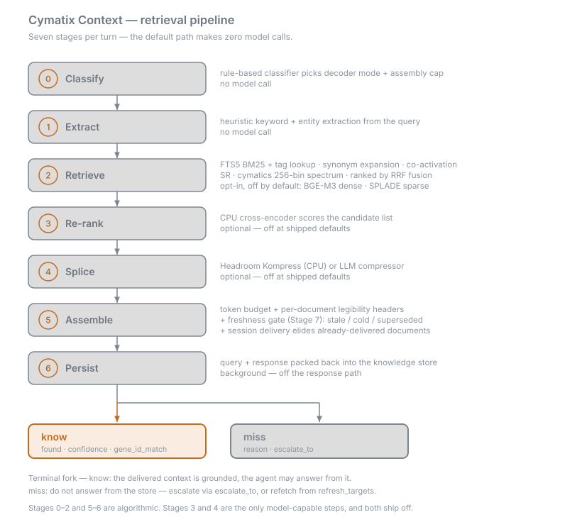

# Pipeline

- Seven stages run per turn. Stages 0–2 and 5–6 are algorithmic — deterministic
  CPU math, no model call. Stages 3 and 4 are the only model-capable steps, and
  both ship **off**.
- So the default retrieval path makes **zero model calls** on the way to an
  answer. The one LLM in the system is the downstream model that consumes the
  assembled window — reached through `POST /v1/chat/completions`, or through
  whatever agent called `/context` in the first place.
- Every turn ends at the same fork: `know { found, confidence, gene_id_match }`
  or `miss { reason, escalate_to }`. See [Agent Contract](Agent-Contract).
- This page documents **v0.9.1**. The wave-1 ranking flip
  ([#407](https://github.com/mbachaud/Cymatix-Context/pull/407)) and the
  `min_delivered_docs` seat floor
  ([#409](https://github.com/mbachaud/Cymatix-Context/pull/409)) are part of
  that release and are marked where they appear.

## Stage 0 — Classify

- A rule-based classifier assigns the query one of five classes: `arithmetic`,
  `factual`, `procedural`, `multi_hop`, `default`. **Algorithmic** — pattern
  scans over the query string, no model call.
- The class selects the decoder mode for the turn and the per-rule assembly cap
  that bounds how many documents reach the window.
- **Decoder mode is resolved from the class *and* the caller**, not the class
  alone. For the default `generic` caller the modes are `minimal`
  (`arithmetic`), `condensed` (`factual`), `full` (`procedural`, `multi_hop`),
  and none at all for `default`. A `small_moe` caller gets its own slate-shaped
  modes for the same classes. Callers select their branch with
  `caller_model_class` — see [HTTP API](HTTP-API).
- `[classifier] enabled` is the only toggle that ships. Per-class caps and
  decoder hints are code constants, not config, pending
  [#205](https://github.com/mbachaud/Cymatix-Context/issues/205). With the
  classifier disabled, every query takes the global path.
- The 2026-08-06 retrieval-layer ledger graded this stage KEEP-CHEAP:
  recall-identical, and its cap shrinks the splice input for free.

## Stage 1 — Extract

- Heuristic keyword, domain, and entity extraction from the query — the same
  CPU tagger (spaCy NER + EntityRuler + regex) that runs at ingest.
  **Algorithmic.**
- A caller-supplied `session_context` contributes path tokens, which are
  injected into the entity set. Those tokens are what later give
  `/context/packet` its coordinate-confidence signal, so supplying them
  materially changes retrieval — an HTTP A/B that varies `session_context` is
  not a clean ablation of anything else.
- **The one optional model call on this path:** query-intent expansion, gated
  by `[compressor] query_expansion_enabled` (legacy: `[ribosome]`). It fires
  once per novel query string, is LRU-cached, and falls back to the raw query
  on any failure. Set it to `false` for a strictly model-free `/context`.
  `/context/packet` never invokes it — the agent-safe surface is model-free
  end to end.

## Stage 2 — Retrieve

- The whole ranking surface, and **entirely algorithmic**. Candidate signals
  that fire at shipped defaults: FTS5 BM25 over document content, exact and
  prefix tag lookup, `[synonyms]` query expansion, an IDF lexical anchor, a
  filename anchor, harmonic co-activation edges, the cymatics 256-bin term
  spectrum, TCM session drift, ray-trace evidence, and an access-rate
  tiebreaker — plus a `party_id` scoping gate. Detail per signal:
  [Retrieval Dimensions](Retrieval-Dimensions).
- **Opt-in, off at shipped defaults:** BGE-M3 dense recall (`[retrieval]
  dense_embedding_enabled`, off since 2026-08-15), SPLADE sparse expansion
  (`[ingestion] splade_enabled`, off since 2026-08-16), and the Tier-0
  path-key index (`[retrieval] pki_enabled`, off since 2026-08-17). Each flip
  is receipt-gated; the receipts are on
  [Benchmarks and Receipts](Benchmarks-and-Receipts).
- **Fusion.** Candidates are ranked by Reciprocal Rank Fusion, the default
  since 2026-07-06 — measured **+12pp gold-document delivery** over the legacy
  additive accumulator on the hardest internal bed (**0.74 vs 0.62**).
  `fusion_mode = "additive"` restores the pre-Stage-3 accumulator and is
  scheduled for condition-gated removal (v(N+2) at earliest, not a calendar
  date).
- **Wave-1 ranking default (0.9.1,
  [#407](https://github.com/mbachaud/Cymatix-Context/pull/407)):** `[retrieval]
  rrf_k` moves **60 → 20**, tightening the rank-position discount so
  high-ranked candidates from any one signal survive fusion. The cross-shard
  merge constant deliberately stays at 60 — that surface is unmeasured and is
  annotated as such in the code.

## Stage 3 — Re-rank

- **Optional, and off.** Two different things are called "rerank" here, and
  only the first involves a model:
  1. **Cross-encoder rerank** — a CPU cross-encoder (`ms-marco-MiniLM-L-6-v2`)
     scores the candidate list. `[retrieval] rerank_enabled` has **always
     shipped `false`** ([#341](https://github.com/mbachaud/Cymatix-Context/issues/341));
     with it off, this stage is skipped entirely. This is the pipeline's only
     retrieval-path model stage.
  2. **Post-fusion rerank classes** — four algorithmic signals (authority,
     `sema_boost`, party attribution, access rate) that combine with the fused
     score through a per-class combinator. `eps_band` lets them break ties only
     inside a relative band of the leader's fused score, so they cannot
     overturn a decisive fusion result.
- **Wave-1 combinator default (0.9.1,
  [#407](https://github.com/mbachaud/Cymatix-Context/pull/407)):**
  `rerank_combinator_by_class` extends from `{multi_hop, default}` to **all
  five classifier classes**, all mapped to `eps_band`.
- **What wave-1 measured**, on the 829k bed at full needle power (n=470):
  gold-document delivery **0.555 → 0.630**, recall@12 **0.651 → 0.681**, median
  gold rank **3 → 2**, and **zero question-type regressions**. Both halves of
  the flip ship as a single commit, so the whole thing reverts with one
  `git revert`.

## Stage 4 — Splice

- **Optional compression, and off at shipped defaults.** Each surviving
  candidate is compressed so more documents fit the same token budget —
  Headroom Kompress (CPU, ModernBERT-class) for prose and code, or an LLM
  compressor when one is configured.
- `[compressor] enabled` (legacy: `[ribosome]`) defaults `false`, and the
  backend string is ignored entirely while it is false. When enabled, only
  `"litellm"` and `"deberta"` are honored; any other value — including the
  legacy `"ollama"` and `"claude"` — dispatches the no-op DisabledBackend.
- Splice is where latency concentrates when it is on: the 2026-08-06
  retrieval-layer ledger attributed the p95 tail to this stage in every arm it
  measured, superlinear in candidate count. That is a dated finding on a 100k
  bed, not a current shipped-defaults measurement — with splice off there is no
  such stage to pay for.

## Stage 5 — Assemble (and the Stage 7 freshness gate)

- Joins the surviving parts, enforces the token budget (`[budget]
  retrieval_tokens`, legacy `expression_tokens`, default **7000**) and the
  per-turn document cap (`max_docs_per_turn`, legacy `max_genes_per_turn`,
  default **12**). **Algorithmic.**
- **Legibility headers** (`legibility_enabled = true`) attach one metadata line
  per document: which tiers fired, a confidence marker, the short document id,
  and the raw-to-compressed character counts. Flip to `false` to restore plain
  dividers for a bench A/B.
- **Freshness gate (Stage 7)** runs during assembly and demotes stale, cold, or
  superseded documents — downgrading the response to
  `miss(reason="stale" | "cold" | "superseded")`. It is the reason a document
  can be retrieved and still not be answerable from.
- **Session delivery register** (`session_delivery_enabled = true`) tracks what
  each session has already received and elides repeats behind a pointer stub.
  The multi-turn savings figure (~40%) is an **unverified design estimate**
  pending the `cymatix_session_tokens_saved_total` counter. Pass
  `ignore_delivered: true` in the `/context` body for benchmarks.
- **Abstain tier.** When post-refinement retrieval is weak on both the absolute
  score and the score ratio, assembly returns a marker-only window rather than
  a broad fallback — the store says "I can't help" instead of spending tokens
  proving it. Under RRF these gates run ratio-only; the absolute floors were
  calibrated against additive fusion.
- **Control-tag neutralization** (`neutralize_control_tags = true`, default on
  since 2026-08-19) escapes a literal `<cymatix:` in retrieved content so an
  ingested document cannot forge the genuine no-match control tags.
- **0.9.1 seat floor (`[budget] min_delivered_docs`,
  [#409](https://github.com/mbachaud/Cymatix-Context/pull/409), default `0` =
  off).** When set, the floor lifts the classifier's per-rule assembly cap to
  at least N and truncates the last document instead of evicting it. Measured
  at floor 12: delivered **0.630 → 0.668** (**+18/−0** needles), per-type
  completeness **0.65 → 0.85**, the constrained slice **0.80 → 0.97**. **The
  default flip was not taken** — the benchmark measures delivery, not answer
  quality under a widened seat count, so the receipts justify the knob but not
  the flip.

## Stage 6 — Persist

- The query-and-response exchange is packed back into the knowledge store in
  the background, off the response path. **Algorithmic** (the CPU tagger path).
- This is what makes the store grow with use, and why co-activation edges
  strengthen between documents that keep getting retrieved together.

## Where the model boundary actually sits

| Stage | Algorithmic | Model-capable | Ships on? |
|---|---|---|---|
| 0 Classify | yes | — | on |
| 1 Extract | yes | query expansion only, flag-gated | on (expansion opt-in) |
| 2 Retrieve | yes | — | on |
| 3 Re-rank | post-fusion classes | cross-encoder | **off** |
| 4 Splice | Headroom Kompress (CPU) | LLM compressor | **off** |
| 5 Assemble + 7 Freshness | yes | — | on |
| 6 Persist | yes | — | on (background) |

- The honest one-line version: *ingest → tag → encode → store → query →
  retrieve → weigh → label → emit* is all CPU; the pipeline crosses the model
  boundary exactly once, at answer generation, and that call is the caller's.

## The four entry flows share these stages

| Endpoint | What it runs | What it returns |
|---|---|---|
| `POST /context` | Stages 0–7, full path | Assembled context + citations + know/miss |
| `POST /context/packet` | Stages 1–2 + the weighing layer; skips splice | Pointers labelled `verified` / `stale_risk` / `needs_refresh`, plus `refresh_targets` — no assembled content |
| `POST /context/refresh-plan` | Packet internals, filtered | `refresh_targets` only — the reread plan |
| `POST /fingerprint` | Stages 1–2 + refiner pass | Scored document pointers, tier contributions, and honest floor accounting — no content, no packet labels |

- The packet path is the **agent-safe** surface: model-free end to end, and it
  returns what to reread rather than a bundle to trust. Full request and
  response shapes: [HTTP API](HTTP-API).

## Go deeper

- [`docs/architecture/PIPELINE_LANES.md`](https://github.com/mbachaud/Cymatix-Context/blob/master/docs/architecture/PIPELINE_LANES.md) — the swim-lane reference: who writes what, which table each stage touches, the four flows in full
- [`docs/architecture/DIMENSIONS.md`](https://github.com/mbachaud/Cymatix-Context/blob/master/docs/architecture/DIMENSIONS.md) — the formal signal inventory behind Stage 2
- [`docs/api/context-endpoint.md`](https://github.com/mbachaud/Cymatix-Context/blob/master/docs/api/context-endpoint.md) — request and response fields for `/context` and `/context/packet`
- [`docs/benchmarks/2026-08-06-retrieval-layer-ledger.md`](https://github.com/mbachaud/Cymatix-Context/blob/master/docs/benchmarks/2026-08-06-retrieval-layer-ledger.md) — the dated cost/impact ledger this page cites for splice and classifier
- Next: [Retrieval Dimensions](Retrieval-Dimensions) · [Agent Contract](Agent-Contract) · [Configuration](Configuration) · [Benchmarks and Receipts](Benchmarks-and-Receipts)
