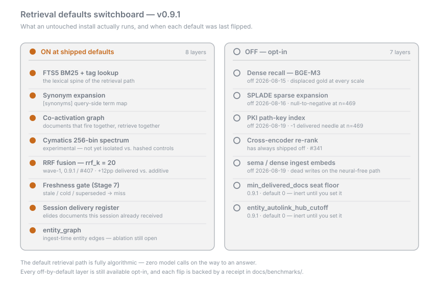

# Retrieval Dimensions

- Retrieval is not one score. It is a set of independent signals — nine
  numbered dimensions plus a few auxiliary tiers — that each nominate and weigh
  candidates, and are then combined by a single fusion step.
- **Every dimension runs on deterministic CPU math.** There is no model call
  anywhere on this page's subject matter; the opt-in encoders (dense, SPLADE)
  are the only neural components, and both ship off.
- The list below is the *inventory*. Whether a dimension actually fires at
  shipped defaults is the "default state" column — and several do not.
- Each default-off state is receipt-gated: a measurement decided it, and the
  measurement is linked. The corresponding cost figures are on
  [Benchmarks and Receipts](Benchmarks-and-Receipts).

## The dimensions

| Dimension | Signal | Cost | Default state (v0.9.1) |
|---|---|---|---|
| **D1** Semantic content | FTS5 BM25 over document text; SPLADE sparse term expansion; SEMA 20-dim cosine as a cold fallthrough | A primary query cost — the lexical backbone the best-scoring arms lean on | **FTS5 on.** SPLADE **off** since 2026-08-16. SEMA cold tier **off** (`[context] cold_tier_enabled`) |
| **D2** Tagging | Exact and prefix lookup against the ingest-time tag index, with query terms expanded through `[synonyms]` | ms-scale at 100k; a substantial per-query cost at 829k in the dated ledger | **on** |
| **D3** Source provenance | `source_id` deny-list gate at the storage boundary, plus a per-source authority weight in fusion | negligible | **on** — provenance fields auto-populate at ingest |
| **D4** Working-set access rate | Sliding-window access-rate over a ring buffer of recent accesses, applied as a capped tiebreaker | negligible | **on** (tiebreaker only) |
| **D5** Lifecycle tier | Three-tier accessibility — hot / warm / cold (legacy: open / euchromatin / heterochromatin) — filtering which documents are even queried | negligible (a filter) | **on**; hot + warm queried, cold excluded unless opted in |
| **D6** Cymatics | MD5-hashed 256-bin term spectrum: resonance overlap, flux integral, harmonic-bin boost | microseconds, LRU-cached | **on** — blended as a capped bonus, not used to re-sort |
| **D7** Document attribution | `party_id` scoping gate over attributed documents; citation enrichment with the authoring party and handle | negligible | **on** where identity is known; authorship-class scoring is **not** live |
| **D8** Co-activation graph | Harmonic spectral edges (Tier 5); shared-entity edges (Tier 5b); SR graph expansion; seeded edges | harmonic small; the gated reads cost nothing while off | harmonic **on**; entity-graph *retrieval* **off**; SR **off**; seeded edges **off** |
| **D9** Temporal context (TCM) | Per-session drift vector that lightly re-sorts already-retrieved candidates | negligible | **on** as a tiebreaker; theta-biased ray tracing **off** |

Auxiliary tiers that fire but are not numbered dimensions:

- **Path-key index (Tier 0)** — compound `(path_token, key)` lookup.
  `[retrieval] pki_enabled` **off** since 2026-08-17
  ([#370](https://github.com/mbachaud/Cymatix-Context/issues/370)).
- **Filename anchor** — a lexical boost on filename matches, on since
  2026-04-22.
- **Lexical IDF anchor** — an inverse-document-frequency anchor over the tag
  index. It issues its own probes *outside* the D2 tag gate, so disabling the
  tag tiers does not stop the tag table being read.
- **Stage-2 dense recall (BGE-M3)** — `[retrieval] dense_embedding_enabled`
  **off** since 2026-08-15.

## Fusion: how the signals become one ranking

- **Reciprocal Rank Fusion is the default ranker** and has been since
  2026-07-06. Each signal contributes a *rank*, not a raw score, so no
  hand-picked exchange rate has to hold across tiers with incompatible scales.
- The receipt: RRF measured **+12pp gold-document delivery** over the legacy
  additive accumulator on the hardest internal bed — **0.74 vs 0.62**. The
  additive path mis-scales dense against the FTS5 BM25 cap, which is what the
  rank-level fusion removes.
- **`fusion_mode = "additive"`** restores the pre-Stage-3 accumulator
  byte-identically. It is DEPRECATED-FOR-REMOVAL on a *condition* gate, not a
  calendar — v(N+2) at the earliest.
- The per-tier weights in `[retrieval]` bind in **both** modes: under
  `"additive"` they are the tier coefficients and caps themselves; under
  `"rrf"` they are rank post-multipliers.
- Under RRF the abstain gates run **ratio-only** — the absolute score floors
  were calibrated against additive fusion and do not transfer.

### Wave-1 ranking defaults (0.9.1, [#407](https://github.com/mbachaud/Cymatix-Context/pull/407))

- **`rrf_k` 60 → 20.** A smaller `k` steepens the rank discount, so a
  candidate that any one signal ranks highly survives fusion instead of being
  averaged away.
- **`rerank_combinator_by_class` extends to all five classifier classes**
  (`arithmetic`, `factual`, `procedural`, `multi_hop`, `default`), each mapped
  to `eps_band` — post-fusion rerank signals break ties only inside a relative
  band of the leader's fused score.
- Measured together on the 829k bed at n=470: gold-document delivery
  **0.555 → 0.630**, recall@12 **0.651 → 0.681**, median gold rank **3 → 2**,
  **zero question-type regressions**.
- The cross-shard merge constant deliberately stays at **60** — that surface
  was not measured, and is annotated as unmeasured in the code rather than
  flipped on faith.

## Cymatics, honestly

- Each term is hashed (MD5) into one of 256 bins and given a small Gaussian
  spread; query and candidate are then compared as the resulting
  256-dimensional vectors. It is a cheap, deterministic, model-free term
  transform.
- **"Cymatics" is a mnemonic for that binned spectrum, not a claim of
  signal-processing semantics.** Nearby bins are hash placement, not related
  meaning. There is no wave physics in the scoring.
- It is a candidate-*reordering* signal that has **not yet been isolated
  against hashed bag-of-words or random-bin controls**. Treat it as an
  experimental cheap feature, not a proven one.
- What has been measured, once: the 2026-08-06 ledger's re-run of the cymatics
  ablation on a 141-needle 100k carve found recall@12 and recall@5 **identical
  across all six arms** — shipped, off, collapsed-spread, and three random-bin
  seeds. The entire measurable effect was confined to sub-window ordering, and
  the shipped arm was **not distinguishable from random binning** — it beat the
  best random seed by 0.0012 MRR against a random-control band of width 0.0035,
  and tied that seed exactly on recall@1. The verdict was KEEP-CHEAP, not
  KEEP-PROVEN — one bed, one needle family, so the standing "not isolated"
  claim above still holds for the project as a whole.
- The binned vector is exposed directly by `POST /fingerprint` if you want to
  look at it. See [HTTP API](HTTP-API).

## What the retrieval-layer ledger measured

The [2026-08-06 retrieval-layer
ledger](https://github.com/mbachaud/Cymatix-Context/blob/master/docs/benchmarks/2026-08-06-retrieval-layer-ledger.md)
is the cost-versus-impact audit of these layers: ablation ladder arms that
self-validate by signal absence, a storage audit that maps GB to layers, and an
adversarial council pass that re-probed the headline claims order-reversed.
**It is a dated document — these are its findings on its beds, not a statement
of current shipped state**, and several defaults have moved since.

| Layer | Ledger verdict (dated) | What happened since |
|---|---|---|
| FTS5 | KEEP-LOAD-BEARING | Still the default backbone |
| SPLADE | REMOVE for ERB-class serving — four scales, recall never crosses zero | Shipped default-off 2026-08-16 |
| Path-key index | REMOVE-CANDIDATE — neutral-to-positive to remove at both 100k and 829k, zero delivery flips | Shipped default-off 2026-08-17 ([#370](https://github.com/mbachaud/Cymatix-Context/issues/370)) |
| Tags (D2) | **SPLIT** — the delivered-gold gain at 100k did **not** replicate at 829k; the storage half is unmeasured | Still on; a `no_lex_anchor` arm ([#355](https://github.com/mbachaud/Cymatix-Context/issues/355)) is owed before any storage action |
| Cymatics | KEEP-CHEAP, now measured — indistinguishable from random binning | Still on, still labelled experimental |
| Co-activation / harmonic | TRIM-CANDIDATE — a post-rank pull-forward, invisible to rank-based recall@12 by construction | Still on; the delivered-basis metric it needs is now armed |
| Entity graph | REMOVE-CANDIDATE, plus a read-path flag leak the ledger found | Flag leak fixed; ingest-side edge building still ships **on** and has **never been ablated on the delivered basis** — deferred in the [#377](https://github.com/mbachaud/Cymatix-Context/issues/377) ledger |
| SEMA (query-side) | REMOVE-CANDIDATE — null even after backfilling every vector | Ingest-side SEMA embedding default-off since 2026-08-19 |
| Synonyms | TRIM-CANDIDATE — the shipped map netted zero-to-negative on that bed: one entry load-bearing, two pool-bloating | Feature kept, map retune still open |
| Classifier | KEEP-CHEAP — recall-identical, and its cap shrinks splice input for free | Unchanged |

**Standing scope limits on all of the above:** 141 carve needles at 100k and 30
of 469 blob needles at 829k, one config profile, one needle family
(needle-in-haystack). At blob scale one needle moves recall@12 by 0.033, so
several of those verdicts rest on one-needle movements and say so.

Two reading rules the ledger's own receipts forced, worth carrying into any
comparison you run:

- **Check `delivered_count` before crediting a delivered-gold gain.** A small
  class of queries discards a rank-1 gold document with an *empty* delivered
  window; any perturbation that flips one back on looks like a retrieval win
  and is not one.
- **Rank-based recall cannot see delivery.** Signals that pull documents
  forward after ranking, and gates that trim the window before assembly, are
  both invisible to recall@k by construction — which is why the delivered basis
  is the metric the 0.9.x work reports.

## Where to change these

- Every knob named on this page lives in `cymatix.toml` under `[retrieval]`,
  `[ingestion]`, `[context]`, `[cymatics]`, or `[synonyms]`. Defaults, flip
  dates, and env-var precedence: [Configuration](Configuration).
- If a query returns nothing, the usual cause is D2, not D1: the query's
  keywords never map to the tags assigned at ingest. Add entries to
  `[synonyms]` — and re-read the ledger row above before adding many.
  Symptom-first version: [Troubleshooting](Troubleshooting).

## Go deeper

- [`docs/architecture/DIMENSIONS.md`](https://github.com/mbachaud/Cymatix-Context/blob/master/docs/architecture/DIMENSIONS.md) — the formal dimension inventory, per-lane implementation status, and the decision gates each lane must clear
- [`docs/architecture/PIPELINE_LANES.md`](https://github.com/mbachaud/Cymatix-Context/blob/master/docs/architecture/PIPELINE_LANES.md) — which table each signal reads at query time
- [`docs/benchmarks/2026-08-06-retrieval-layer-ledger.md`](https://github.com/mbachaud/Cymatix-Context/blob/master/docs/benchmarks/2026-08-06-retrieval-layer-ledger.md) — the full cost/impact ledger, its addenda, and its scope limits
- [`docs/benchmarks/2026-08-14-encoder-isolation-scale-curve.md`](https://github.com/mbachaud/Cymatix-Context/blob/master/docs/benchmarks/2026-08-14-encoder-isolation-scale-curve.md) — the four-scale receipts behind the dense and SPLADE default-off flips
- [`docs/benchmarks/2026-07-06-sike-run2-fts-depth-fusion.md`](https://github.com/mbachaud/Cymatix-Context/blob/master/docs/benchmarks/2026-07-06-sike-run2-fts-depth-fusion.md) — the RRF-versus-additive receipt
- [`docs/benchmarks/BASELINES.md`](https://github.com/mbachaud/Cymatix-Context/blob/master/docs/benchmarks/BASELINES.md) — the comparability ledger every bed row is pinned against
- Next: [Pipeline](Pipeline) · [Configuration](Configuration) · [Benchmarks and Receipts](Benchmarks-and-Receipts) · [Architecture Map](Architecture-Map)
